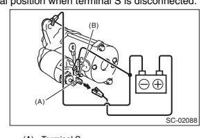

## General Description 1. A:  Specification 1.  2.5 L Model

| 1.  2.5 L MODEL                          | Specifications                                                              |                                        |
|------------------------------------------|-----------------------------------------------------------------------------|----------------------------------------|
| ltem                                     |                                                                             |                                        |
| Vehicle model                            | CVT                                                                         | MT                                     |
| Type                                     | Reduction type                                                              |                                        |
| Model                                    | 428000-4790                                                                 | 428000-4780                            |
| Manufacturer                             | DENSO                                                                       |                                        |
| Voltage and output                       | 12 V - 1.6 kW                                                               |                                        |
| Direction of rotation                    | Counterclockwise (when observed from pinion)                                |                                        |
| Number of pinion teeth                   | 9                                                                           |                                        |
| Voltage                                  | 11 V                                                                        |                                        |
| Current                                  | 90 A or less                                                                |                                        |
| No-load characteristics                  | Rotating                                                                    |                                        |
| Starter                                  | 1,900 rpm or more                                                           |                                        |
| speed                                    |                                                                             |                                        |
| Voltage                                  | 8 V                                                                         |                                        |
| Current                                  | 370 A                                                                       |                                        |
| Load characteristics                     | Torque                                                                      | 1.1 N·m (1.1 kgf-m, 8.2 ft-lb) or more |
| Rotating                                 | 910 rpm or more                                                             |                                        |
| speed                                    |                                                                             |                                        |
| Voltage                                  | 3 V                                                                         |                                        |
| Lock characteristics                     | Current                                                                     | 750 A or less                          |
| 15.5 N·m (1.6 kgf-m, 11.4 ft-lb) or more |                                                                             |                                        |
| Torque                                   | Rotating-field three-phase type, voltage regulator built-in type, with load |                                        |
| Type                                     | response control system                                                     |                                        |
| Model                                    | A3TG6191                                                                    |                                        |
| Manufacturer                             | Mitsubishi Electric                                                         |                                        |
| Voltage and output                       | 12 V - 110 A                                                                |                                        |
| Polarity on ground side                  | Negative                                                                    |                                        |
| Direction of rotation                    | Clockwise (when observed from pulley side)                                  |                                        |
| Stator connection                        | 3-phase △ type                                                              |                                        |
| Generator                                | 1,500 rpm - 50 A or more                                                    |                                        |
| Output current                           | 2,500 rpm - 91 A or more                                                    |                                        |
| 5,000 rpm - 105 A or more                |                                                                             |                                        |
| Regulated voltage                        | 14.1 - 14.8 V [20°C (68°F)]                                                 |                                        |
| Rotor slip ring outer                    | Standard                                                                    | 2.7 mm (0.894 in)                      |
| diameter                                 | Limit                                                                       | 2.1 mm (0.870 in)                      |
| Standard                                 | 18.5 mm (0.728 in)                                                          |                                        |
| Brush length                             | Limit                                                                       | 5.0 mm (0.197 in)                      |
| Battery                                  | Type and capacity                                                           | 12 V - 52 AH (75D 23R)                 |

| 2.                                                                          | 3.6 L MODEL                                  | ltem                                    | Specifications   |
|-----------------------------------------------------------------------------|----------------------------------------------|-----------------------------------------|------------------|
| Vehicle model                                                               | AT                                           |                                         |                  |
| Type                                                                        | Reduction type                               |                                         |                  |
| Model                                                                       | 428000-5250                                  |                                         |                  |
| Manufacturer                                                                | DENSO                                        |                                         |                  |
| Voltage and output                                                          | 12 V - 1.6 kW                                |                                         |                  |
| Direction of rotation                                                       | Counterclockwise (when observed from pinion) |                                         |                  |
| Number of pinion teeth                                                      | 9                                            |                                         |                  |
| Voltage                                                                     | 1 V                                          |                                         |                  |
| Current                                                                     | 90 A or less                                 |                                         |                  |
| No-load characteristics                                                     | Rotating                                     |                                         |                  |
| Starter                                                                     | 1,550 rpm or more                            |                                         |                  |
| speed                                                                       |                                              |                                         |                  |
| Voltage                                                                     | 8 V                                          |                                         |                  |
| Current                                                                     | 370 A                                        |                                         |                  |
| Load characteristics                                                        | Torque                                       | 12.8 N·m (1.3 kgf-m, 9.4 ft-lb) or more |                  |
| Rotating                                                                    | 800 rpm or more                              |                                         |                  |
| speed                                                                       |                                              |                                         |                  |
| Voltage                                                                     | 3 V                                          |                                         |                  |
| Lock characteristics                                                        | Current                                      | 750 A or less                           |                  |
| Torque                                                                      | 19.0 N·m (1.9 kgf-m, 14.0 ft-lb) or more     |                                         |                  |
| Rotating-field three-phase type, voltage regulator built-in type, with load |                                              |                                         |                  |
| Type                                                                        | response control system                      |                                         |                  |
| Model                                                                       | ATJ3591                                      |                                         |                  |
| Manufacturer                                                                | Mitsubishi Electric                          |                                         |                  |
| Voltage and output                                                          | 12 V - 130 A                                 |                                         |                  |
| Polarity on ground side                                                     | Negative                                     |                                         |                  |
| Direction of rotation                                                       | Clockwise (when observed from pulley side)   |                                         |                  |
| Stator connection                                                           | 3-phase △ type                               |                                         |                  |
| Generator                                                                   | 1,500 rpm - 55 A or more                     |                                         |                  |
| Output current                                                              | 2,500 rpm - 108 A or more                    |                                         |                  |
| 5,000 rpm - 127 A or more                                                   |                                              |                                         |                  |
| Regulated voltage                                                           | 14.1 - 14.8 V [20°C (68°F)]                  |                                         |                  |
| Rotor slip ring outer                                                       | Standard                                     | 2.7 mm (0.894 in)                       |                  |
| diameter                                                                    | Limit                                        | 2.1 mm (0.870 in)                       |                  |
| Standard                                                                    | 2.5 mm (0.886 in)                            |                                         |                  |
| Brush length                                                                | Limit                                        | 5.0 mm (0.197 in)                       |                  |
| Battery                                                                     | Type and capacity                            | 12 V - 52 AH (75D 23R)                  |                  |

## B:  Component

STARTER
1.

(2)

| Starter seal            |
|-------------------------|
| Overrunning clutch ASSY |
| Washer                  |
| Planetary gear          |

(3)
Magnet switch ASSY
Shift lever
(4)
Starter seal
(5) (6) (7)

| (11)   |
|--------|
| (12)   |
| (13)   |

(9)
Yoke
(10)
T1:
1.4 (0.1, 1.0)
T2:
6 (0.6, 4.4)

| Armature          |
|-------------------|
| Brush holder ASSY |
| Drain duct        |
| Starter cover     |

| T3:   | 7.5 (0.8, 5.5)   |
|-------|------------------|
| T4:   | 10 (1.0, 7.4)    |

## 2.  Generator

(2)
Pulley
(3)
Front cover
(4)
Ball bearing
(5)
(6)
Bearing retainer Rotor
(8)
Stator coil
(9)
IC regulator
(10)
Brush
(11)
Rectifier
(12)
Rear cover Tightening torque:N·m (kgf-m, ft-lb)
4.7 (0.5, 3.5)
T1:
108 (11.0, 79.8)
T2:

Pulley nut Tightening torque:N·m (kgf-m, ft-lb)
(1)

| Rotor   |
|---------|

(8)
Bearing
(2) (3)
Pulley Front cover
(4)
Ball bearing
(5)
Bearing retainer
(6)
Spacer

| (12)   |
|--------|
| (13)   |
| (14)   |

| Rear cover   |
|--------------|
| Terminal B   |

(7)
(9)
Stator coil
(10)
IC regulator Brush
(11)
Rectifier

| T1:   | 4.4 (0.4, 3.2)    |
|-------|-------------------|
| T2:   | 3.9 (0.4, 2.9)    |
| T3:   | 17.5 (12.0, 86.7) |
| T4:   | 2 (0.2, 1.5)      |
| T5:   | 8.9 (0.9, 6.6)    |

## 3.  Generator Bracket

| SC-02439   |                             |      |                        |                                      |                |
|------------|-----------------------------|------|------------------------|--------------------------------------|----------------|
| (1)        | V-belt cover bracket        | (6)  | Generator plate        | Tightening torque:N·m (kgf-m, ft-lb) |                |
| (2)        | Collector cover bracket     | (7)  | A/C compressor bracket | T1:                                  | 6.4 (0.7, 4.7) |
| (3)        | V-belt tensioner ASSY       | (8)  | ldler pulley           | T2:                                  | 16 (1.6, 11.8) |
| (4)        | Power steering pump bracket | (9)  | Stopper rod RH         | T3:                                  | 20 (2.0, 14.8) |
| (5)        | Generator                   | (10) | Stopper rod LH         | T4:                                  | 2 (2.2, 16.2)  |
| T5:        | 25 (2.5, 18.4)              |      |                        |                                      |                |
| T6:        | 3 (3.4, 24.3)               |      |                        |                                      |                |
| T7:        | 36 (3.7, 26.6)              |      |                        |                                      |                |

Tightening torque:N·m (kgf-m, ft-lb)
(1)
Generator
(3)
Collector cover bracket
(2)
Power steering pump bracket T1:
6.4 (0.7, 4.7)
T2:
16 (1.6, 11.8)
T3:

| T3:   | 25 (2.5, 18.4)   |
|-------|------------------|

## C: Caution

- Wear appropriate work clothing, including a cap, protective goggles and protective shoes when performing any work.

- Remove contamination including dirt and corrosion before removal, installation or disassembly.

- Keep the disassembled parts in order and protect them from dust and dirt.

- Before removal, installation or disassembly, be sure to clarify the failure. Avoid unnecessary removal, installation, disassembly and replacement.

 Vehicle components are extremely hot after driving. Be wary of receiving burns from heated parts.

.

.

Be sure to tighten fasteners including bolts and nuts to the specified torque.

Place shop jacks or rigid racks at the specified points.

.

- Before disconnecting connectors of sensors or units, be sure to disconnect the ground cable from the battery.

| Circuit tester   |
|------------------|

## D:  Preparation Tool 1.  General Tool

| TOL NAME                                           | REMARKS   |
|----------------------------------------------------|-----------|
| Used for measuring resistance, voltage and current |           |

## 2 Starter Removal A:

2) Remove the cover (A) and clip (B) from air intake
boot assembly. (2.5 L non-turbo model)

3) Loosen the clamp (A) which connects the air in-
take boot assembly and air cleaner case. (2.5 L n-turbo model)
4) Loosen the clamp (B) which connects the air intake boot assembly and throttle body. (2.5 L nonturbo model)

5) Remove the air intake boot from the throttle body, and move it to the left side wheel apron. (2.5 L non-turbo model)

take boot assembly. (3.6 L model)
7) Loosen the bolt (B) which secures the air intake boot assembly to the collector cover bracket. (3.6 L

model)

it to the left side wheel apron. (3.6 L model)

10) Disconnect the connector (B) and terminal (A)

NOTE:

## B: Installation

Install in the reverse order of removal.

NOTE:
For the MT model, a bolt is used in place (A).

Tightening torque:

50 N·m (5.1 kgf-m, 36.9 ft-lb)

Tightening torque:

NOTE:
Align the clamp hole with the protrusion of the air in-

take boot assembly.

Tightening torque:
Clamp (A), (B)

- 3.6 L model

## Tightening Torque:

Clamp (A)
3 N·m (0.3 kgf-m, 2.2 ft-lb)
Bolt (B)

ن 1) Remove the nut which holds terminal M (A) of
the magnet switch assembly, then disconnect the

harness from the terminal.

2) Remove the nuts fastening the magnet switch assembly to the starter housing, then remove the

8) Remove the planetary gear (A) and washer (B)

er from the brush holder assembly.

NOTE: Separate the starter cover by pressing the brush holder assembly using the screws so that the as-

10) Remove the brush holder assembly from the armature.

NOTE:
Spread the brush with your fingers, being careful

2) Install the brush holder assembly to the armature.

NOTE:
Spread the brush with your fingers, being careful not to damage the brush.

to the internal gear.

(1) Apply grease to the planetary gear installation position.

## Grease: Denso Hl50

(2) Install the planetary gear to the pin. (3) Apply grease to the planetary gear, internal gear, washer, and upper part of the pin.

NOTE:
- Apply grease so that it contacts each gear.

- Be careful not to allow dirt to get in.

## Grease:

DENSO HL50

NOTE: Apply grease to the contact portion of the shift lever.

## Grease:

DENSO HL50

7) Install the starter housing, and tighten through bolts on both sides.

9) Install the magnet switch assembly to the starter housing, and tighten the nuts.

NOTE:
Apply grease to the shift lever installation position.

## Grease: Denso Hl50 Tightening Torque:

7.5 N·m (0.8 kgf-m, 5.5 ft-lb)

magnet switch assembly, and tighten the nut.

## Tightening Torque:

10 N·m (1.0 kgf-m, 7.4 ft-lb)

## E:  Inspection 1.  Switch Assembly

Using a circuit tester (set to "ohm"), check that there is continuity between terminals S and M, and between terminal S and ground.

Also check to be sure there is no continuity between terminals M and B.

## Terminal/Resistance:

(B)
Terminal M
(C)   Terminal B

## Switch Assembly Operation 2.

NOTE:
Perform each test in a short period of time (3 - 5 sec).

1) Suction test Check that the pinion gear comes flying out when the harness is disconnected from terminal M and connected as shown in the figure.

(A)
Terminal S
(B)
Terminal M
2) Holding test Check that the pinion gear remains flying out after

the cable is disconnected from terminal M.

(A)
3) Returning test With terminal S connected to the positive terminal, and terminal M and starter body connected to the battery ground terminal to suction the main contact point, check that the pinion gear returns to its original position when terminal S is disconnected.

## 3.  Performance Test

The starter should be submitted to performance tests whenever it has been overhauled, to assure its satisfactory performance when installed on the engine.

Three performance tests, no-load test, load test, and lock test, are presented here; however, if the load test and lock test cannot be performed, carry out at least the no-load test.

For these performance tests, use the circuit shown in figure.

Variable resistance
(A)
(C) Starter body

## 1) No-Load Test

Adjust the variable resistance with the switch on until the voltage is 11 V, and read the value displayed on the ammeter to measure rotating speed.

Compare these values with the standard.

## No-Load Test (Standard): Voltage/Current

Max. 11 V/90 A or less Rotating speed 2.5 L model 1,900 rpm or more 3.6 L model 1,550 rpm or more 2) Load test Apply the specified braking torque to starter. The condition is normal if the current draw and rotating speed are within standard.

## Load Test (Standard): Voltage/Load 2.5 L Model

8 V/11.1 N·m (1.1 kgf-m, 8.2 ft-lb) or more 3.6 L model 8 V/12.8 N·m (1.3 kgf-m, 9.4 ft-lb) or more Current/Rotating speed 2.5 L model 370 A/910 rpm or more 3.6 L model 370 A/800 rpm or more 3) Lock test With the starter stalled, or not rotating, measure the torque developed and current draw when the voltage is adjusted to standard voltage.

## Lock Test (Standard):

Voltage/Current 3 V/750 A or less

## Torque

2.5 L model 15.5 N·m (1.6 kgf-m, 11.4 ft-lb) or more 3.6 L model 19.0 N·m (1.9 kgf-m, 14.0 ft-lb) or more

## 4.  Other Inspections

Check that the starter does not have deformation, cracks and any other damage.

## 3. Generator A:  Removal

BELT,      REMOVAL,
V-belt.>
to ME(H4DOTC)-42, V-BELT, REMOVAL, V-belt.>
<Ref. to ME(H6DO)-51, REMOVAL, V-belt.> 3) Disconnect the connector and terminal from

gnnrjter.

4) Remove the collector cover bracket or v-belt
cover bracket.

## B:  Installation

Install in the reverse order of removal.

Tightening torque:
T1: 25 N·m (2.5 kgf-m, 18.4 ft-lb)
T2: 6.4 N·m (0.7 kgf-m, 4.7 ft-lb)

## 1.  2.5 L Model

1) Remove the four through-bolts.

2) Use a drier to heat the rear cover (A) portion to 50°C (122°F).

3) Insert the end of a flat tip screwdriver into the gap between stator core and front cover. Pry them

apart to disassemble.

(A) Screwdriver 4) Using a vise, support the rotor and remove the pulley nut, then remove the rotor from the front cover.

When holding the rotor with a vise, place aluminm plates or wooden pieces on the vise jaws

(B)
Pulley
(C)
Pulley nut
() Rotor 5) Use the following procedures to remove the ball bearings.

(1) Remove the bolt, and then detach the bear-

(2) Firmly attach an appropriate tool (such as a
correct size socket wrench) to the bearing inner race.

(3) Use the press to push the ball bearings out
from the front cover.

6) Using the bearing puller, remove the bearings from the rotor.

7) Disconnect the connection between the rectifier and stator coil, then remove the stator coil.

CAUTION: The rectifier is easily damaged by heat. Do not allow a 180 - 270 W soldering iron to contact

regulator.

(1) Remove the screws which secure the IC
regulator to the rear cover.

regulator and rectifier, then remove the IC reg-

9) Use the following procedures to remove the

brush.

(A)   Cover A
(2) Remove the cover B.

(A)   Cover B
(3) Disconnect the connection and remove the

brush.

10) Remove the rectifier as follows.
(1) Remove the bolts which secure the rectifier.

3) Insert the end of a flat tip screwdriver into the gap between stator core and front cover. Pry them apart to disassemble.

(A)   Screwdriver 4) Using a vise, support the rotor and remove the pulley nut, then remove the rotor from the front cover.

When holding the rotor with a vise, place aluminm plates or wooden pieces on the vise jaws

()   Pulley nut
() Rotor 5) Use the following procedures to remove the ball bearings.

(1) Remove the bolt, and then detach the bear-

ing retainer.

(2) Firmly attach an appropriate tool (such as a
correct size socket wrench) to the bearing inner race.

(3) Use the press to push the ball bearings out from the front cover.

6) Using the bearing puller, remove the bearings from the rotor.

7) Remove six bolts between the rectifier and stator coil, then remove the stator coil.

8) Remove four screws which secure the IC regulator to the rear cover, then remove the IC regulator.

9) Use the following procedures to remove the brush.

(1) Remove the cover A.

(A)   Cover A
(2) Remove the cover B.

(A)   Cover B
(3) Disconnect the connection and remove the brush.

10) Remove the rectifier as follows.

and remove the rectifier.

## D:  Assembly 1.  2.5 L Model

Assemble in the reverse order of disassembly.

NOTE:
- Refer to component for tightening torque of each part. <Ref. to SC(H4SO)-5, GENERATOR, COM-
PONENT, General Description.>
- After assembling, manually turn the pulley to check that the rotor rotates smoothly.

1) Push of the brush Before assembling the front and rear parts, press the brush down into the brush holder, then fix the brush in that position by inserting a [1 mm (0.04 in)
dia., 40 - 50 mm (1.6 - 2.0 in) long] wire through the hole as shown in the figure.

After re-assembling, remove the wire.

2) Install the ball bearings.

(1) Set the ball bearings in the front cover, then securely install an appropriate tool (such as a socket wrench of proper size) to the bearing outer race. (2) Using a press to press the ball bearings into the specified location. (3) Install the bearing retainer.

3) Use a press to install the bearings (rear side) to the rotor shaft. 4) Heat the bearing box in rear cover to 50 - 60°C
(122 - 140°F), and then press the rear bearing into rear cover.

Do not apply grease to the rear bearings. If there is any oil on the bearing box, remove it completely.

## 2.  3.6 L Model

Assemble in the reverse order of disassembly.

NOTE:
- Refer to component for tightening torque of each part. <Ref. to SC(H4SO)-5, GENERATOR, COM-
PONENT, General Description.>
- After assembling, manually turn the pulley to check that the rotor rotates smoothly.

1) Push of the brush Before assembling the front and rear parts, press the brush down into the brush holder, then fix the brush in that position by inserting a [1 mm (0.08 in)
dia., 40 - 50 mm (1.6 - 2.0 in) long] wire through the hole as shown in the figure.

CAUTION:

After re-assembling, remove the wire.

() Wire 2) Install the ball bearings.

(1) Set the ball bearings in the front cover, then securely install an appropriate tool (such as a socket wrench of proper size) to the bearing outer race.

(2) Using a press to press the ball bearings into the specified location. (3) Install the bearing retainer.

3) Use a press to install the bearings (rear side) to the rotor shaft.

4) Heat the bearing box in rear cover to 50 - 60°C
(122 - 140°F), and then press the rear bearing into rear cover.

CAUTION: Do not apply grease to the rear bearings. If there is any oil on the bearing box, remove it completely.

## E:  Inspection 1.  Diode (2.5 L Model) Caution:

There is the possibility of damaging the diodes if a mega-tester (used to measure high voltages) or a similar measuring instrument is used. Never use a mega tester or equivalent for this test.

1) Check for continuity between the diode lead and positive side heat sink. If resistance is 1 Ω or more oly in the direction from the diode lead to the heat sink, replace the rectifier.

Diode lead
(A)
2) Check for continuity between the negative side heat sink and diode lead. If resistance is 1 Ω or more only in the direction from the heat sink to the diode lead, replace the rectifier.

Diode lead
(A)

## Diode (3.6 L Model) 2. Caution:

There is the possibility of damaging the diodes if a mega-tester (used to measure high voltages) or a similar measuring instrument is used.

Never use a mega tester or equivalent for this test.

1) Check for continuity between the diode lead and terminal E or B. If continuity is not as shown in the table, replace the rectifier.

- At analog type tester

| Tester lead     | Continuity      |     |
|-----------------|-----------------|-----|
| -lead           | +lead           |     |
| E               | P1, P2, P3, P4, | Yes |
| P5, P6          | None            |     |
| None            |                 |     |
| P1, P2, P3, P4, |                 |     |
| P5, P6          | B               | Yes |

At digital type testen

3.

ROTOR
1) Inspect the slip rings for contamination or any roughness on the sliding surface. Repair the slip ring surface using a lathe or sand paper.

2) Measure the slip ring outer diameter. Replace the rotor if the slip ring is worn.

Slip ring outer diameter:
Standard 2.7 mm (0.894 in)
Limit 2.1 mm (0.870 in)
3) Using a circuit tester, check the resistance between slip rings. If resistance exceeds the stand, replace the rotor.

4) Check the continuity between slip ring and rotor
core or shaft. If there is continuity, replace the rotor because the rotor coil is grounded.

5) Check the ball bearings. If there is any noise, or
the rotor does not rotate smoothly, replace the bearings.

## 4.  Stator Coil (2.5 L Model)

1) Inspect continuity between the stator coil lead wire terminals. If the resistance is 1 MΩ or more, replace the stator coil.

() Stator 2) Inspect the continuity between the stator coil stator core and lead wire terminals. If the resistance is 1 Ω or less, replace the stator coil.

2) Insulation test Inspect the continuity between the stator coil stator core and lead wire terminals. If there is continuity, replace the stator coil because the stator coil is grounded.

## 3.6 L Model 5.

1) Continuity test Inspect the continuity between the stator coil terminals. If continuity is not as shown in the table, re-

place the stator coil.

## Brush

6.

1) Measure the length of each brush. Replace the brush if wear exceeds service limits. There is a service limit mark (A) on each brush.

## Brush Length:

.

2.5 L model Standard (1)
18.5 mm (0.728 in)
Limit (2)
5.0 mm (0.197 in)
.

3.6 L model Standard (1)
2.5 mm (0.886 in)
Limit (2)

5.0 mm (0.197 in)

2) Using a spring pressure indicator, push the brush into the brush holder until its tip protrudes 2 mm (0.08 in). Then measure the pressure of brush spring. If the pressure is 2.648 N (270 g, 9.52 oz) or less, replace the brush spring with a new part.

4.609 - 5.786 N (470 - 590 g, 16.58 - 20.810

Check the ball bearings. Replace the ball bearings if there is resistance in the rotation, or if there is any anormal noise.

## 8.  Other Inspections

Check that the generator does not have deformation, cracks and any other damage.

## Battery 4. A:  Removal

1) After disconnecting the battery ground terminal, remove the terminal cover, then disconnect the positive terminal.

2) Remove the battery cable holder from the battery rod. 3) Remove flange nut from the battery rod and remove battery holder.

## B:  Installation

Install in the reverse order of removal.

## Tightening Torque: 3.5 N·M (0.4 Kgf-M, 2.6 Ft-Lb)

NOTE: - Clean the battery cable terminals and apply grease to retard the formation of corrosion.

- Connect the positive (+) terminal, and then connect the negative (–) terminal of the battery. - After the battery is installed, initial diagnosis of the electronic throttle control is performed. Wait for 10 seconds or more after turning the ignition switch to ON, and then start the engine.

## C: Inspection

WARNING:
- Electrolyte is corrosive acid, and has toxicity; be careful of handling the fluid.

- Make sure the electrode does not come into contact with skin, eyes or clothing. Especially at contact with eyes, flush with water for 15 minutes and get prompt medical attention.

- In addition, be careful not to let the electrode contact with the coated parts. - Be careful when handling the batteries because they produce explosive gases.

-  Be sure to keep battery away from any fire.

- For safety, in case an explosion does occur, wear eye protection or shield your eyes when working near any battery. In addition, never lean over the battery.

- Ventilate sufficiently when using or charging battery in enclosed space.

- Before starting work, remove rings, metal watch-bands, and other metal jewelry.

- Never allow metal tools to contact the positive battery terminal and anything connected to it while you are at the same time in contact with any other metallic portion of the vehicle.

## External Parts 1.

Check the battery case, top cover, vent plugs, and terminal posts for dirt or cracks. If necessary, clean with water and wipe with a dry cloth.

Apply a thin coat of grease on the terminal posts to prevent corrosion.

## 2.  Electrolyte Level

Check the electrolyte level in each cell. If the level is below MIN level, bring the level to MAX level by pouring distilled water into the battery cell. Do not fill beyond MAX level.

## 3.  Specific Gravity Of Electrolyte

1) Measure specific gravity of electrolyte using a hydrometer and a thermometer.

Specific gravity varies with temperature of electrolyte so that it must be corrected at 20°C (68°F) using the following calculation:
S20 = St + 0.0007 × (t − 20)
S20: Specific gravity corrected at electrolyte temperature of 20°C (68°F)
St: Measured specific gravity t: Measured temperature (°C)
Judge whether or not battery must be charged, according to corrected specific gravity.

Standard specific gravity: 1.220 - 1.290 [at 2°C (68°F)]
2) Measuring the specific gravity of the electrolyte in the battery will disclose the state of charge of the battery. The relation between specific gravity and state of charge is as shown in the figure.

## Measurement D: Warning:

Do not bring an open flame close to the battery when working.

- Prior to charging, corroded terminals should be cleaned with a brush and common caustic soda solution. -  Be careful since battery electrolyte overflows while charging the battery. - Observe instructions when handling the battery charger. - Before charging the battery on the vehicle, disconnect the battery ground terminal to prevent damage of generator diodes or other electrical units.

## 1.  Judgment Of Battery In Charged Condition

1) Specific gravity of electrolyte should be held within the specific range from 1.250 to 1.290 for one hour or more.

2) Voltage per battery cell should be held at a specific value in a range from 2.5 to 2.8 V for one hour or more.

## 2.  Check Condition Of Charge With Hydrometer

| Hydrometer                                    | State of charge   | Corrective action         |
|-----------------------------------------------|-------------------|---------------------------|
| indicator                                     |                   |                           |
| Green dot                                     | 65% or more       | Load test                 |
| Dark dot                                      | 65% or less       | Charge battery            |
| Replace the battery.                          |                   |                           |
| Clear dot                                     | Low electrolyte   | (f cranking is difficult) |
| * Check electrical system before replacement. |                   |                           |

## 3.  Normal Charging

Charge the battery at the current value specified by manufacturer or at approximately 1/10 of battery's ampere-hour rating.

## 4.  Quick Charging

CAUTION:
- Observe the items in "3. NORMAL CHARG-
ING".

- Never use 10 A or more when charging the battery because it will shorten the battery life.

Quick charging is a method that the battery is charged in a short period of time with a relatively large current by using a quick charger. Since a large current flow raises electrolyte temperature, the battery is subject to damage if the large current is used for prolonged time. For this reason, quick charging must be carried out within a current range that will not raise the electrolyte temperature to 40°C (104°F) or more. Also the quick charging is a temporary mean to bring battery voltage up to some level, and battery should be charged slowly with low current as a rule.

12LE_US.book 1 ページ 2011年9月28日 水曜日 午後4時17分

ENGINE (DIAGNOSTICS)

EN(H4SO)(diag)

Page

1. Basic Diagnostic Procedure .......................................................................2 2. Check List for Interview ..............................................................................4 3. General Description ...................................................................................6 4. Electrical Component Location ..................................................................9 5. Engine Control Module (ECM) I/O Signal ................................................17 6. Engine Condition Data .............................................................................26 7. Data Link Connector ................................................................................27 8. General Scan Tool ...................................................................................28 9. Subaru Select Monitor ..............................................................................33

10. Read Diagnostic Trouble Code (DTC) .....................................................39 11. Inspection Mode .......................................................................................40 12. Drive Cycle ...............................................................................................45 13. Clear Memory Mode .................................................................................51 14. System Operation Check Mode ...............................................................52 15. Malfunction Indicator Light .......................................................................53 16. Diagnostics for Engine Starting Failure ....................................................63 17. Diagnostic Procedure for Subaru Select Monitor Communication ...........76 18. List of Diagnostic Trouble Code (DTC) ....................................................78 19. Diagnostic Procedure with Diagnostic Trouble Code (DTC) ....................86 20. General Diagnostic Table .......................................................................292
