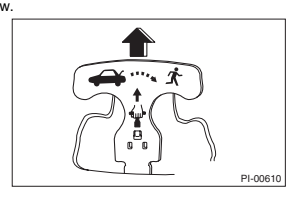
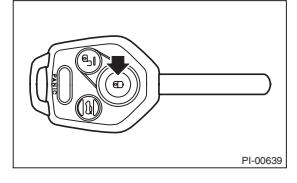
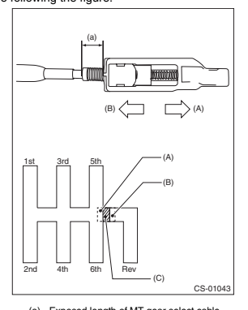

## Diagnosis 8.

Diagnosis uses step-by-step process to make operations easier.

## 9.  Si Units

Measurements in these manuals are according to the SI units. Metric and yard/pound measurements are also included.

Example:

## Tightening Torque: 4 N·M (4.5 Kgf-M, 33 Ft-Lb) List Of Si Unit

| List of SI unit       |                     |                   |                          |
|-----------------------|---------------------|-------------------|--------------------------|
| Item                  | SI units            | Conventional unit | Remarks                  |
| Force                 | N (Newton)          | kgf               | 1 kgf = 9.807 N          |
| Mass (Weight)         | kg, g               | kg, g             |                          |
| Capacity              | l, m ℓ  or cm³      | l or cc           | 1 cc = 1 cm³ = 1 m ℓ     |
| N·m                   | 1 kgf-m = 9.807 N·m |                   |                          |
| Torque                | kgf-m, kgf-cm       |                   |                          |
| Rotating speed        | rpm                 | rpm               | 1 kgf/cm² = 98.07 kPa    |
| kgf/cm²               |                     |                   |                          |
| Pressure              | kPa (Kilopascal)    | mHg               | 1 mmHg = 0.1333 kPa      |
| Power                 | W                   | PS                | 1 PS = 0.7355 kW         |
| W·h                   | 1 kcal = 1.163 W·h  |                   |                          |
| Calorie               | cal                 |                   |                          |
| Fuel consumption rate | g/kW·h              | g/PS·h            | 1 g/PS·h = 1.3596 g/kW·h |

The figure used in these manuals are described in the SI units and conventional units are described in (
).

## 10.Explanation Of Terminology

| 10.EXPLANATION OF TERMINOLOGY   |                                              |                       |                                        |
|---------------------------------|----------------------------------------------|-----------------------|----------------------------------------|
| List                            | H/L                                          | Headlight             |                                        |
| 2ndr                            | Secondary                                    | H/U                   | Hydraulic Unit                         |
| A                               | Air Assist Injection                         | HVAC                  | Heater, Ventilator and Air Conditioner |
| I/F                             | Interface                                    |                       |                                        |
| AR                              | Angular Adjusted Roller                      |                       |                                        |
| A/B                             | Airbag                                       | IG                    | Ignition                               |
| IN                              | Intake                                       |                       |                                        |
| ABS                             | Anti-lock Brake System                       |                       |                                        |
| A/C                             | Air Conditioner                              | INT                   | Intermittent                           |
| AC                              | Angular Contact                              | I/O                   | Input/Output                           |
| IR                              | Infrared Ray                                 |                       |                                        |
| ACC                             | Accessory                                    |                       |                                        |
| A/F                             | Air Fuel Ratio                               | ISC                   | Idle Speed Control                     |
| LAN                             | Local Area Network                           |                       |                                        |
| ALT                             | Generator                                    |                       |                                        |
| APS                             | Accessory Power Supply Socket                | LCD                   | Liquid Crystal Display                 |
| LED                             | Light Emitting Diode                         |                       |                                        |
| ASY                             | Assembly                                     | LH                    | LH (Left Hand)                         |
| AT                              | Automatic Transmission                       |                       |                                        |
| ATF                             | Automatic Transmission Fluid                 | LHD                   | Left Hand Drive                        |
| LSD                             | Limited Slip Differential                    |                       |                                        |
| AUX                             | Auxiliary Storage Unit (External Storage)    |                       |                                        |
| AVCS                            | Active Valve Control System                  | M/B                   | Main Fuse & Relay Box                  |
| AWD                             | All Wheel Drive                              | MD                    | Mini Disc                              |
| MID                             | Multi Information Display                    |                       |                                        |
| BATT                            | Battery                                      |                       |                                        |
| BCM                             | Brake Control Module                         | MFI                   | Multi-Point Fuel Injection             |
| MP-T                            | Multi-Plate Transfer                         |                       |                                        |
| BJ                              | Bell Joint                                   |                       |                                        |
| CAN                             | Controller Area Network                      | MT                    | Manual Transmission                    |
| NA                              | Natural Aspiration                           |                       |                                        |
| CD                              | Compact Disc                                 |                       |                                        |
| CD Recordable/Rewritable        | NC                                           | Normal Close (Relay)  |                                        |
| CD-R/RW                         |                                              |                       |                                        |
| COMPL                           | Complete                                     | NO                    | Normal Open (Relay)                    |
| On-Board Diagnosis              |                                              |                       |                                        |
| CPC                             | Canister Purge Control Solenoid Valve        | O                     |                                        |
| CPU                             | Central Processing Unit                      | OP                    | Option Parts                           |
| DCCD                            | Driver's Control Center Differential         | PC                    | Personal Computer                      |
| Double Overhead Camshaft        | PCD                                          | Pitch Circle Diameter |                                        |
| DOHC                            |                                              |                       |                                        |
| DOJ                             | Double Offset Joint                          | PCV                   | Positive Crankcase Ventilation         |
| DTC                             | Diagnosis Trouble Code                       | PID                   | Parameter Identification               |
| DVD                             | Digital Versatile Disc or Digital Video Disc | Pr                    | Primary                                |
| EBD                             | Electronic Brake Distribution                | P/S                   | Power Steering                         |
| PTJ                             | Pillow Tripod Joint                          |                       |                                        |
| EBJ                             | High-efficiency Compact Ball Fixed Joint     |                       |                                        |
| ECM                             | Engine Control Module                        | P/W                   | Power Window                           |
| EDJ                             | High-Efficiency Compact Double Offset        | RAM                   | Random Access Memory                   |
| Joint                           | RH                                           | RH (Right Hand)       |                                        |
| E/G                             | Engine                                       | RHD                   | Right Hand Drive                       |
| EGI                             | Electronic Gasoline Injection                | ROM                   | Read Only Memory                       |
| EGR                             | Exhaust Gas Recirculation                    | rpm                   | Revolution Per Minute                  |
| ELR                             | Emergency Locking Retractor                  | R                     | Rear                                   |
| ETC                             | Electronic Throttle Control                  | SDI                   | Subaru Diagnostic Interface            |
| EX                              | Exhaust                                      | SI                    | Subaru Intelligent                     |
| F/B                             | Fuse & Joint Box                             | SOHC                  | Single Overhead Camshaft               |
| FL                              | Fusible Link                                 | S                     | Supplemental Restraint System          |
| Ft                              | Front                                        | SM                    | Subaru Select Monitor                  |
| FWD                             | Front Wheel Drive                            | ST                    | Special Tool                           |
| GPS                             | Global Positioning System                    | STD                   | Standard                               |
| HI                              | High                                         | SW                    | Switch                                 |
| HID                             | High-Intensity Discharge                     | T/B                   | Turbocharger                           |
| HU-7                            |                                              |                       |                                        |

HOW TO USE THIS MANUALS

| TCS    | Traction Control System         |
|--------|---------------------------------|
| TCM    | Transmission Control Module     |
| TGV    | Tumble Generator Valve          |
| T/M    | Transmission                    |
| TPMS   | Tire Pressure Monitoring System |
| UJ     | Universal Joint                 |
| UV     | Ultraviolet                     |
| VDC    | Vehicle Dynamics Control        |
| V.I.N. | Vehicle Identification Number   |
| ViS-C  | Viscous Coupling                |
| VSV    | Vacuum Switching Valve          |
| VTD    | Variable Torque Distribution    |
| W/H    | Wiring Harness                  |

# Specifications

| Page   |
|--------|
| LEGACY |
| 1.     |
| 2.     |

## Legacy 1. A:  Dimension 1.  Sedan Model

| Model                    | 2.5 L SOHC non-turbo   | 2.5 L DOHC turbo   | 3.6 L DOHC non-turbo   |              |              |
|--------------------------|------------------------|--------------------|------------------------|--------------|--------------|
| Overall length           | mm (in)                | 4,735 (186.4)      |                        |              |              |
| Overall width            | mm (in)                | 1,820 (71.7)       |                        |              |              |
| Overall height (at C.W.) | mm (in)                | 1,505 (59.3)       |                        |              |              |
| Wheelbase                | m (in)                 | 2,750 (108.3)      |                        |              |              |
| Front                    | mm (in)                | 1,565 (61.6)       | 1,550 (61.0)           | 1,565 (61.6) |              |
| Tread                    | Rear                   | m (in)             | 1,570 (61.8)           | 1,555 (61.2) | 1,570 (61.8) |
| Minimum road clearance   | m (in)                 | 150 (5.9)          |                        |              |              |

## Engine B:

| Model                                            | 2.5 L SOHC non-turbo       | 2.5 L DOHC turbo         | 3.6 L DOHC non-turbo   |                 |
|--------------------------------------------------|----------------------------|--------------------------|------------------------|-----------------|
| Horizontally opposed,                            |                            |                          |                        |                 |
| Horizontally opposed, liquid cooled, 4-cylinder, |                            |                          |                        |                 |
| Engine type                                      | liquid cooled, 6-cylinder, |                          |                        |                 |
| 4-stroke gasoline engine                         | 4-stroke gasoline engine   |                          |                        |                 |
| Valve arrangement                                | Overhead camshaft          | 92.0 × 91.0              |                        |                 |
| Bore × stroke                                    | mm (in)                    | 9.5 × 79.0 (3.92 × 3.11) | (3.622 × 3.583)        |                 |
| Displacement                                     | cm³ (cu in)                | 2,457 (149.94)           | 3,630 (221.5)          |                 |
| Compression ratio                                | 10.0                       | 9.5                      | 10.5                   |                 |
| Ignition order                                   | 1 - 6 - 3 - 2 - 5 - 4      |                          |                        |                 |
| 1 - 3 - 2 - 4                                    |                            |                          |                        |                 |
| Idle speed at Park or                            | 650±100(MT)                | 700±100                  | 700±100                |                 |
| rpm                                              |                            |                          |                        |                 |
| Neutral position                                 | 675±100(CVT)               |                          |                        |                 |
| Maximum output                                   | kW (HP)/rpm                | 127 (170)/5,600          | 198 (265)/5,600        | 191 (256)/6,000 |
| 350 (35.7, 258)/2,000                            |                            |                          |                        |                 |
| Maximum torque                                   | N·m (kgf-m, ft-lb)/rpm     | 20 (23.5, 170)/4,000     | 34 (34.1, 247)/4,400   |                 |
| 5,200                                            |                            |                          |                        |                 |

## Electrical ن

| Model                       | 2.5 L SOHC non-turbo    | 2.5 L DOHC turbo      | 3.6 L DOHC non-turbo   |                |
|-----------------------------|-------------------------|-----------------------|------------------------|----------------|
| 10°±10°(MT),                |                         |                       |                        |                |
| Ignition timing (at idling) | BTDC                    | 15°±10°               | 15°±8°                 |                |
| 15°±10°(CVT)                |                         |                       |                        |                |
| Spark plug                  | Type and manufacturer   | NGK: SIFR6A11         | NGK: SILFR6B8          | NGK: SILFR6C11 |
| Generator                   | 12 V -                  | 110 A                 | 12 V - 130 A           |                |
| Battery                     | Type and capacity (5HR) | 12 V - 52 AH (75D23R) |                        |                |

## Transmission D: 1. Mt

| Model                  | 2.5 L SOHC non-turbo   | 2.5 L DOHC turbo   |         |        |
|------------------------|------------------------|--------------------|---------|--------|
| Transmission type      | 6MT                    | 6MT                |         |        |
| Clutch type            | DSPD                   | DSPD               |         |        |
| 1st                    | 3.454                  | 3.454              |         |        |
| 2nd                    | 1.947                  | 1.947              |         |        |
| 3rd                    | 1.296                  | 1.296              |         |        |
| Gear ratio             | 4th                    | 0.972              | 0.972   |        |
| 5th                    | 0.825                  | 0.780              |         |        |
| 6th                    | 0.695                  | 0.666              |         |        |
| Rev.                   | 3.636                  | 3.636              |         |        |
| Type of gear           | Hypoid                 | Hypoid             |         |        |
| Reduction gear (Front) | Gear ratio             | 4.111              | 4.111   |        |
| Transfer               | Type of gear           | Helical            | Helical |        |
| reduction              | 1.000                  | 1.000              |         |        |
| Reduction gear         | Gear ratio             |                    |         |        |
| (Rear)                 | Final                  | Type of gear       | Hypoid  | Hypoid |
| reduction              | Gear ratio             | 4.111              | 4.111   |        |

6MT: 6-forward and 1-reverse speeds with synchromesh for all gears DSPD: Dry Single Plate Diaphragm 2.

## At

| Model                 | 3.6 L DOHC non-turbo   |            |       |
|-----------------------|------------------------|------------|-------|
| Transmission type     | 5AT                    |            |       |
| Clutch type           | TCC                    |            |       |
| 1st                   | 3.540                  |            |       |
| 2.264                 |                        |            |       |
| 2nd                   |                        |            |       |
| 3rd                   | 1.471                  |            |       |
| Gear ratio            | 4th                    | 1.000      |       |
| 5th                   | 0.834                  |            |       |
| Rev.                  | 2.370                  |            |       |
| Type of gear          | Helical                |            |       |
| 1st                   |                        |            |       |
| Reduction gear        | reduction              | Gear ratio | 1.000 |
| (Front)               | Type of gear           |            |       |
| Final                 | Hypoid                 |            |       |
| reduction             | Gear ratio             | 3.083      |       |
| Type of gear          | Hypoid                 |            |       |
| Reduction gear (Rear) | Gear ratio             | 3.083      |       |

5AT: Electronically controlled fully-automatic, 5-forward speeds and 1-reverse TCC: Torque Converter Clutch

## 3. Cvt

| Model                    | 2.5 L SOHC non-turbo   |        |
|--------------------------|------------------------|--------|
| Transmission type        | CVT                    |        |
| Clutch type              | TCC                    |        |
| Forward                  | 3.525 - 0.558          |        |
| Change gear ratio        | Rev.                   | 2.358  |
| Type of gear             | Helical                |        |
| 1st                      |                        |        |
| reduction                |                        |        |
| Reduction gear           | Gear ratio             | 1.000  |
| (Front)                  | Type of gear           | Hypoid |
| Final                    |                        |        |
| reduction                | Gear ratio             | 3.700  |
| Transfer reduction ratio | 1.000                  |        |
| Type of gear             | Hypoid                 |        |
| Reduction gear (Rear)    | Gear ratio             | 3.700  |

TCC: Torque Converter Clutch CVT: Forward continuously variable speed change and 1-reverse

## Ü Steering

| Type                | Rack & pinion   |             |
|---------------------|-----------------|-------------|
| Turns, lock to lock | 2.8             |             |
| Minimum turning     | Curb to curb    | 11.2 (36.7) |
| m (ft)              |                 |             |
| diameter            | Wall to wall    | 1.8 (38.7)  |

## Suspension F:

Front Rear

| Macpherson strut type suspension   |
|------------------------------------|
| Double wishbone type suspension    |

## G:  Brake

| Model                | 2.5 L SOHC non-turbo                                    | 2.5 L DOHC turbo      | 3.6 L DOHC non-turbo   |
|----------------------|---------------------------------------------------------|-----------------------|------------------------|
| Service brake system | Dual circuit hydraulic with vacuum suspended power unit |                       |                        |
| Front                | Ventilated disc brake                                   |                       |                        |
| Rear                 | Disc brake                                              | Ventilated disc brake |                        |
| Parking brake        | Electric mechanical on rear brakes                      |                       |                        |
| Brake assist         | Standard equipment for all vehicles                     |                       |                        |

## H: Tire

| Model           | 2.5 L SOHC non-turbo          | 2.5 L DOHC turbo   | 3.6 L DOHC non-turbo   |
|-----------------|-------------------------------|--------------------|------------------------|
| 16 × 6 1/2JJ    |                               |                    |                        |
| Wheel size      | 16 × 6 1/2J                   | 18 × 7 1/2J        | 17 × 7 1/2J            |
| 17 × 7 1/2J     |                               |                    |                        |
| P205/60 R16 91V |                               |                    |                        |
| Tire size       | 25/45 R18 91W                 | P225/50 R17 93V    |                        |
| P215/50 R17 90V |                               |                    |                        |
| Type            | Tubeless, Steel belted radial |                    |                        |

## Capacity

| l:                          | CAPACITY            | 2.5 L DOHC         | 3.6 L DOHC     |                |                |                |
|-----------------------------|---------------------|--------------------|----------------|----------------|----------------|----------------|
| 2.5 L SOHC non-turbo        |                     |                    |                |                |                |                |
| Model                       | turbo               | nn-turbo           |                |                |                |                |
| 6MT                         | CVT                 | 6MT                | 5AT            |                |                |                |
| Fuel tank                   | l (US gal, Imp gal) | 70 (18.5, 15.4)    |                |                |                |                |
| Total capacity              | l (US qt, Imp qt)   | 4.8 (5.1, 4.2)     | 4.8 (5.1, 4.2) | 5.2 (5.5, 4.6) | 7.8 (8.2, 6.9) |                |
| (t overhaul)                | When replacing      |                    |                |                |                |                |
| Engine oil                  | Filling amount of   | engine oil and oil | 4.2 (4.4, 3.7) | 4.2 (4.4, 3.7) | 4.3 (4.5, 3.8) | 6.5 (6.9, 5.7) |
| engine oil                  | filter              |                    |                |                |                |                |
| ℓ  (US qt, Imp qt)          | When replacing      | 4.0 (4.2, 3.5)     | 6.3 (6.7, 5.5) |                |                |                |
| engine oil only             |                     |                    |                |                |                |                |
| Transmission gear oil       | ℓ  (US qt, Imp qt)  | 3.7 (3.9, 3.3)     | 3.7 (3.9, 3.3) |                |                |                |
| 12.0 - 12.5                 | 9.6 - 10.0          |                    |                |                |                |                |
| ATF or CVTF                 | ℓ  (US qt, Imp qt)  | (12.7 - 13.2,      | (10.1 - 10.6,  |                |                |                |
| 10.6 - 11.0)                | 8.4 - 8.8)          |                    |                |                |                |                |
| 1.3 - 1.5                   | 1.3 - 1.5           |                    |                |                |                |                |
| Front differential gear oil | l (US qt, Imp qt)   | (1.4 - 1.6,        | (1.4 - 1.6,    |                |                |                |
| 1.1 - 1.3)                  | 1.1 - 1.3)          |                    |                |                |                |                |
| Rear differential gear oil  | l (US qt, Imp qt)   | 0.8 (0.8, 0.7)     |                |                |                |                |
| Power steering fluid        | l (US qt, Imp qt)   | 0.7 (0.7, 0.6)     |                |                |                |                |
| Engine coolant              | ℓ  (US qt, Imp qt)  | 6.5 (6.9, 5.7)     | 6.4 (6.8, 5.6) | 6.6 (7.0, 5.8) | 6.5 (6.9, 5.7) |                |

2.

## Otback A:  Dimension 1.  Outback Model

| Model                    | 2.5 L SOHC non-turbo   | 3.6 L DOHC non-turbo         |              |
|--------------------------|------------------------|------------------------------|--------------|
| Overall length           | m (in)                 | 4,780 (188.2)                |              |
| Overall width            | m (in)                 | 1,820 (71.7)                 |              |
| Overall height (at C.W.) | m (in)                 | 1,680 (66.1), 1,670 (65.7) 1 |              |
| Wheelbase                | m (in)                 | 2,740 (107.9)                |              |
| Front                    | mm (in)                | 1,550 (61.0)                 |              |
| Tread                    | Rear                   | m (in)                       | 1,550 (61.0) |
| Minimum road clearance   | m (in)                 | 20 (8.7)                     |              |

1: When crossbar is stored

## B: Engine

| Model                                | 2.5 L SOHC non-turbo                 | 3.6 L DOHC non-turbo                 |                             |
|--------------------------------------|--------------------------------------|--------------------------------------|-----------------------------|
| Horizontally opposed, liquid cooled, | Horizontally opposed, liquid cooled, |                                      |                             |
| Engine type                          | 4-cylinder, 4-stroke gasoline engine | 6-cylinder, 4-stroke gasoline engine |                             |
| Valve arrangement                    | Overhead camshaft                    |                                      |                             |
| Bore × stroke                        | mm (in)                              | 9.5 × 79.0 (3.92 × 3.11)             | 92.0 × 91.0 (3.622 × 3.583) |
| Displacement                         | cm 3 (cu in)                         | 2,457 (149.94)                       | 3,630 (221.5)               |
| Compression ratio                    | 10.0                                 | 10.5                                 |                             |
| Ignition order                       | 1 - 3 - 2 - 4                        | 1 - 6 - 3 - 2 - 5 - 4                |                             |
| ldle speed at Park on                | 650±100(MT)                          |                                      |                             |
| rpm                                  | 700±100                              |                                      |                             |
| 675±100(CVT)                         |                                      |                                      |                             |
| Neutral position                     |                                      |                                      |                             |
| Maximum output                       | kW (HP)/rpm                          | 127 (170)/5,600                      | 191 (256)/6,000             |
| Maximum torque                       | N·m (kgf-m, ft-lb)/rpm               | 20 (23.5, 170)/4,000                 | 34 (34.1, 247)/4,400        |

## Electrical ن

| Model                       |  2.5 L SOHC non-turbo   | 3.6 L DOHC non-turbo      |                |
|-----------------------------|-------------------------|---------------------------|----------------|
| Ignition timing (at idling) | BTDC                    | 10°±10°(MT), 15°±10°(CVT) | 15°±8°         |
| Spark plug                  | Type and manufacturer   | NGK: SIFR6A11             | NGK: SILFR6C11 |
| Generator                   | 12 V - 110 A            | 12 V - 130 A              |                |
| Battery                     | Type and capacity (5HR) | 12 V - 52 AH (75D23R)     |                |

## Transmission D: 1. Mt

| Model                  | 2.5 L SOHC non-turbo   |              |        |
|------------------------|------------------------|--------------|--------|
| Transmission type      | 6MT                    |              |        |
| Clutch type            | DSPD                   |              |        |
| 1st                    | 3.454                  |              |        |
| 2nd                    | 1.947                  |              |        |
| 3rd                    | 1.296                  |              |        |
| Gear ratio             | 4th                    | 0.972        |        |
| 5th                    | 0.825                  |              |        |
| 6th                    | 0.695                  |              |        |
| Rev.                   | 3.636                  |              |        |
| Type of gear           | Hypoid                 |              |        |
| Reduction gear (Front) | Gear ratio             | 4.444        |        |
| Transfer               | Type of gear           | Helical      |        |
| reduction              | 1.000                  |              |        |
| Reduction gear         | Gear ratio             |              |        |
| (Rear)                 | Final                  | Type of gear | Hypoid |
| reduction              | Gear ratio             | 4.444        |        |

6MT: 6-forward and 1-reverse speeds with synchromesh for all gears DSPD: Dry Single Plate Diaphragm 2.

## At

| Model                 | 3.6 L DOHC non-turbo   |            |       |
|-----------------------|------------------------|------------|-------|
| Transmission type     | 5AT                    |            |       |
| Clutch type           | TCC                    |            |       |
| 1st                   | 3.540                  |            |       |
| 2nd                   | 2.264                  |            |       |
| 3rd                   | 1.471                  |            |       |
| Gear ratio            | 4th                    | 1.000      |       |
| 5th                   | 0.834                  |            |       |
| Rev.                  | 2.370                  |            |       |
| Type of gear          | Helical                |            |       |
| 1st                   |                        |            |       |
| Reduction gear        | reduction              | Gear ratio | 1.000 |
| (Front)               | Type of gear           |            |       |
| Final                 | Hypoid                 |            |       |
| reduction             | Gear ratio             | 3.083      |       |
| Type of gear          | Hypoid                 |            |       |
| Reduction gear (Rear) | Gear ratio             | 3.083      |       |

5AT: Electronically controlled fully-automatic, 5-forward speeds and 1-reverse TCC: Torque Converter Clutch

## 3. Cvt

| Model                    | 2.5 L SOHC non-turbo   |        |
|--------------------------|------------------------|--------|
| Transmission type        | CVT                    |        |
| Clutch type              | TCC                    |        |
| Forward                  | 3.525 - 0.558          |        |
| Change gear ratio        | Rev.                   | 2.358  |
| Type of gear             | Helical                |        |
| 1st                      |                        |        |
| reduction                |                        |        |
| Reduction gear           | Gear ratio             | 1.000  |
| (Front)                  | Type of gear           | Hypoid |
| Final                    |                        |        |
| reduction                | Gear ratio             | 3.900  |
| Transfer reduction ratio | 1.000                  |        |
| Type of gear             | Hypoid                 |        |
| Reduction gear (Rear)    | Gear ratio             | 3.900  |

TCC: Torque Converter Clutch CVT: Forward continuously variable speed change and 1-reverse

## Ü Steering

| Model               | 2.5 L SOHC      | 3.6 L DOHC   |
|---------------------|-----------------|--------------|
| Type                | Rack and pinion |              |
| Turns, lock to lock | 3.2             |              |
| Minimum turning     | Curb to curb    | 1.2 (36.7)   |
| m (ft)              |                 |              |
| diameter            | Wall to wall    | 1.8 (38.7)   |

## Suspension F:

Front

| Macpherson strut type suspension   |
|------------------------------------|
| Double wishbone type suspension    |

Rear

## G:  Brake

| Model                 | 2.5 L SOHC non-turbo                                    | 3.6 L DOHC non-turbo   |
|-----------------------|---------------------------------------------------------|------------------------|
| Service brake system  | Dual circuit hydraulic with vacuum suspended power unit |                        |
| Ventilated disc brake |                                                         |                        |
| Front                 |                                                         |                        |
| Rear                  | Disc brake                                              | Ventilated disc brake  |
| Parking brake         | Electric mechanical on rear brakes                      |                        |
| Brake assist          | Standard equipment for all vehicles                     |                        |

## H: Tire

| Model           | 2.5 L SOHC non-turbo          | 3.6 L DOHC non-turbo   |
|-----------------|-------------------------------|------------------------|
| 16 × 6 1/2JJ    |                               |                        |
| Wheel size      | 17 × 7J                       |                        |
| 17 × 7J         |                               |                        |
| P215/70 R16 99S |                               |                        |
| Tire size       | P225/60 R17 98T               |                        |
| P225/60 R17 98T |                               |                        |
| Type            | Tubeless, Steel belted radial |                        |

l:

## Capacity

| 2.5 L SOHC non-turbo        | 3.6 L DOHC non-turbo   |                    |                                  |                |
|-----------------------------|------------------------|--------------------|----------------------------------|----------------|
| Model                       | 6MT                    | CVT                | 5AT                              |                |
| Fuel tank                   | l (US gal, Imp gal)    | 70 (18.5, 15.4)    |                                  |                |
| Total capacity              | l (US qt, Imp qt)      | 4.8 (5.1, 4.2)     | 4.8 (5.1, 4.2)                   | 7.8 (8.2, 6.9) |
| (t overhaul)                | When replacing         | 4.2 (4.4, 3.7)     |                                  |                |
| Engine oil                  | Filling amount of      | engine oil and oil | 4.2 (4.4, 3.7)                   | 6.5 (6.9, 5.7) |
| engine oil                  | filter                 |                    |                                  |                |
| l (US qt, Imp qt)           | When replacing         | 4.0 (4.2, 3.5)     | 6.3 (6.7, 5.5)                   |                |
| engine oil only             |                        |                    |                                  |                |
| Transmission gear oil       | l (US qt, Imp qt)      | 3.7 (3.9, 3.3)     | 12.0 - 12.5                      | 9.6 - 10.0     |
| ATF or CVTF                 | ℓ  (US qt, Imp qt)     | (12.7 - 13.2,      | (10.1 - 10.6,                    |                |
| 10.6 - 11.0)                | 8.4 - 8.8)             |                    |                                  |                |
| Front differential gear oil | l (US qt, Imp qt)      | l                  | 1.3 - 1.5 (1.4 - 1.6, 1.1 - 1.3) |                |
| Rear differential gear oil  | 0.8 (0.8, 0.7)         |                    |                                  |                |
| l (US qt, Imp qt)           |                        |                    |                                  |                |
| Power steering fluid        | l (US qt, Imp qt)      | 0.7 (0.7, 0.6)     |                                  |                |
| Engine coolant              | ℓ  (US qt, Imp qt)     | 6.5 (6.9, 5.7)     | 6.4 (6.8, 5.6)                   | 6.5 (6.9, 5.7) |

# Precaution

| Page   |
|--------|

1. Precaution 1. VEHICLE DYNAMICS CONTROL (VDC)
Handle the VDC as a total system. Do not disassemble or attempt to repair parts which are not instructed in this manual. Follow the directions in this manual when performing maintenance on the VDCCM&H/U. When parts other than those specified are disassembled, it is possible that the VDC system will not operate when needed or cause it to operate incorrectly and result in injury.

## 2. Electronic Parking Brake

Handle the electronic parking brake as a total system. Do not disassemble or attempt to repair individual parts. Doing so could prevent the electronic parking brake system from operating when needed, or the system may operate incorrectly and result in injury.

3. BRAKE FLUID
If brake fluid gets in your eyes or on your skin, do the following:
- Wash eyes and seek immediate medical attention.

- Wash your skin with soap and then rinse thoroughly with water.

4. RADIATOR FAN
The radiator fan may rotate without warning, even when the engine is not ON. Do not place your hand, cloth, tools or other items near the fan at any time.

5. ROAD TEST
Always conduct road tests in accordance with traffic rules and regulations to avoid bodily injury and interrupting traffic.

6. AIRBAG
To prevent bodily injury from unexpected deployment of airbags and unnecessary maintenance, follow the instructions in this manual when performing maintenance on the airbag components and nearby, around front of the vehicle (radiator panel, front wheel apron, front side frame, front bumper, front hood panel, front fender panel), around side of the vehicle (front door panel, rear door panel, center pillar, rear fender panel, side sill, rear wheel apron), around rear of the vehicle (the rear seat cushion, rear floor pan, rear crossmember) and the airbag wiring harnesses and nearby.

To prevent unexpected deployment, turn the ignition switch to OFF and disconnect the ground cable from battery, then wait at least 60 seconds to discharge backup power supply before starting work.

7. AIRBAG AND SEAT BELT PRETENSIONER DISPOSAL
To prevent bodily injury from unexpected airbag deployment, do not dispose the airbag modules or seat belt pretensioner in the same way as other waste. Follow the special instructions for disposal in this manual. Follow all government regulations concerning disposal of refuse.

8. AIRBAG MODULE
Adhere to the following when handing and storing the airbag module to prevent bodily injury from unexpected deployment:
- Do not hold the harnesses or connectors to carry the module.

- Do not face the bag in the direction that it opens towards yourself or other people.

- Do not face the bag in the direction that it opens towards the floor or walls.

9. AIRBAG SPECIAL TOOL
To prevent unexpected deployment, only use special tools.

10.WINDOW
Always wear safety glasses when working around any glass to prevent glass fragments from damaging your eyes.

11.WINDOW ADHESIVE
Always use the recommended or equivalent adhesive when attaching glass to prevent it from coming falling, resulting in accidents and injury.

PC-2 13.FUEL
When handling and storing fuel, carefully observe the following to prevent unexpected accidents.

- Be careful with fire.

- Prepare a container and cloth to prevent scattering of fuels when performing work where fuels can be spilled. If the fuel spills, wipe it off immediately to prevent it from penetrating the floor or flowing out, to protect the environmental.

- Follow all government and local regulations concerning disposal of refuse when disposing.

14.ENGINE COOLANT
When handling engine coolant, adhere to the following to prevent from unexpected accident.

- Never remove the radiator cap since engine coolant may blow out when it is hot.

- Prepare a container and cloth to prevent scattering of engine coolant when performing work where engine coolant can be spilled. If the oil spills, wipe it off immediately to prevent from penetrating into floor or flowing out for environmental protection.

- Follow all government and local regulations concerning disposal of refuse when disposing.

15.AIR CONDITIONER REFRIGERANT
In order to prevent from global warming, avoid releasing air conditioner refrigerant into the atmosphere. Using a refrigerant recovery system, discharge and reuse it.

16.REMOVAL AND INSTALLATION OPERATION OF HOSES, ETC.

1. Before the removal and installation operation of hoses, etc. - If you keep using the damaged or deformed hose, it results bleeds or leakage of the fat adheres or disconnection of the hose. Be careful not to spill fat adheres on exhaust pipes, etc. during maintenance to prevent emitting smoke or causing fires.

## - Perform The Operation With The Hose Removed. If The Operation Is Performed Without Removing The Hose, It May Damage Inner Surface Of The Hose. 2. Removal And Installation Operation Of Hoses,

etc. during the inspection
- **Follow the instructions below when removing hose.**
- Do not use a pointed hose remover (hose plucker) when using a general hose remover. It may damage the pipe surface or the hose.

NG(1)

PC-00065
PC-3
- If you keep using the hose, perform the inspection below and replace the hose with a new part if faulty.

- Replace the hose with a new part if it rides over the stay or spool.

(1) Hose rides over the stay

- Check if the surface and the inner surface of the hose are damaged, cracked, bend, hardened, softened, swelled, peeled or deformed due to the adherence or the entry of the foreign matter by bending the hose. Replace with the nw part if faulty.

 Follow the instructions below during installa-
.

tion.

- Check carefully for assembling position.

- Never use lubricants.

Insert the hose to the specified position (stop-
.

per or spool) securely.

 Push against the spool. (Insert the hose and 
(1)
prevent it from becoming wrinkled.)
Tighten the hose outwards and apply force thor-
(2)
oughly.
- Check if the position, direction and hose layout of the hose clamp are correct. (Check if the position, direction, length and the gap around are correct, or if it is different from the condition before the work)
- After the installation, check that the hose is installed securely and there is no leakage. (Check if it is fixed securely with the clamp)
 For hose clips and hose clamps, perform the inspection below and replace them with a new part if faulty.

- Check for deformation, rust, damage or foreign matters.

- For hose clip, check if it works and has clamping force.

- For hose clamp, check if it can tighten screw, not ovalized or the screw is not damaged.

- For hose pipes, perform the inspection below and replace with a new part if faulty.

Check if the pipe is not damaged, rusted, peeled
(peeled plates included), covered with foreign matter, bent, compressed or cracked.

-  For the parts below, replaces with a new part when the hose is removed or the installation position is changed.

ATF cooler hose, engine oil cooler hose, power steering suction hose, power steering return hose, fuel hose (delivery/return)

# Note

1.

1.

## Note Basic Repair Hint A:

This section describes basic points that the service operator must understand before performing the service operation.

## 1. Appearance

- Always wear clean work clothing.

Wear a cap and protective shoes.

.

## 2.  Protection Of Vehicle Under Maintenance And Preparation Of Tools/ Equipment

- Before work, cover the vehicle body. (Ex. grille cover, fender cover, seat cover and floor mat cover)
Before performing the service operation, prepare tools, equipment, container box, grease and cloth etc.

.

## 3. Safety

- Before work, set the wheel stoppers to secure the vehicle.

- When performing work by multiple workers, call to each other to make sure that service operation is performed safely.

- Before starting engine, ventilate the room.

- When performing the service operation of high-temperature parts like muffler, rotating parts like fan and other movable parts, be careful not to get burned or injured.

- For the jack-up and lift up, set the tool to the proper location to support the vehicle correctly. And use the safety device properly when lifting up.

## 4.  Service Operation

- By identifying the vehicle problems thoroughly before work, service operation will be performed effectively. - Before removing parts, confirm the installation condition or the damage of the parts.

To reinstall parts properly, leave a note of the condition before work as necessary.

.

 For a part which needs positioning, take appropriate action such as putting alignment marks.

.

- For a removed part, clean it as necessary and check for damage and defect before installation.

## 5.  Removed Part

- A removed part must be organized to avoid mixing up with similar parts. When same parts are used in multiple locations, such as pistons in engine, manage the parts by using labels with cylinder No. so that the parts are not installed to the wrong location.

- Always replace nonreusable parts such as gasket and O-ring with new parts.

- After work, have a customer confirm the replaced part.

## 6.  When Removing Battery

When removing battery, power supply is cut off and the information stored in the computer memory is volatilized. Therefore, setting information of some device is initialized to the factory default. The device and functions initialized by removing battery are as follows. - Clock

- Set temperature of fully automatic air conditioner
- Automatic full open/close of driver's window
(power window needs to be initialized)
-  User setting items in the navigation system
- Past trouble history (memory code)

## B: Note

This is the information that can improve the efficiency of maintenance and assure the sound work.

## 1.  Fasteners Notice

Fasteners must be tightened to the specified torque.

Do not apply paint, lubricant, rust retardant or other substance to the surface around bolts, nuts, etc.

Doing so will make it difficult to obtain the correct torque and result in looseness and other problem.

## Caution: Do Not Spray Parts Cleaner Directly To Rubber Parts Such As Bushing Or Other Resin Parts. 2.  Static Electricity Damage

Do not touch the control modules, connectors, logic boards and other such parts when there is a risk of static electricity. Always use a static electricity prevention cord or touch grounded metal for the elimintion of static electricity before conducting work.

## 3. Battery

When removing the battery terminal, always be sure to turn the ignition switch to OFF and remove the battery ground cable first.

## 4.  Backup/Power Supply Fuse

Right after the vehicle has arrived, 10A backup fuse is removed to avoid run-down of the battery.

Connect the backup fuse as shown in the figure. Also, delivery mode is canceled by disconnecting the backup fuse from the fuse holder.

## 5.  Immobilizer Related Part

Do not replace parts which have immobilizer ID (all ignition key, combination meter, body integrated unit, ECM, and security control module for Canada)
with the parts from other vehicle.

## 6.  Service Parts

Use genuine parts for maximum performance and maintenance when conducting repairs. Subaru/FHI
will not be responsible for poor performance resulting from the use of parts except for genuine parts.

## 7.  Protecting Vehicle Under Main- Tenance

Make sure to attach the fender cover, seat covers, etc. before work.

## 8.  Ensuring Security During Work

When working in a group of two or more, perform the work with calling each other to ensure mutual safety.

## 9.  Lift And Jack

When using a lift or shop jack to raise a vehicle or using rigid rack to support a vehicle, always follow instructions concerning jack-up points and weight limits to prevent the vehicle from falling, which could result in injury. Be especially careful that the vehicle is balanced before raising it. Be sure to set the wheel stoppers when jacking-up only the front or rear side of the vehicle.

## Caution: Select The Lift Attachment So That The Side Sill Does Not Contact The Lift Arm. Note:

- When using a lift, follow its operation manual. - When the side sill cover contacts the lift arm, use a lift attachment. - Do not work or leave unattended while the vehicle is supported with jack, support it with rigid racks.

- Be sure to use the rigid racks with rubber attached to cradle to support the vehicle.

- When using a lift, use an attachment or something similar.

- When using a plate lift, use a rubber attachment.

Place the attachment to the specified position of the vehicle, by adjusting front/rear and left/right sides accordingly.

- Align the cushion rubber center part of plate lift with the center part of rubber attachment.

- Do not use the plate lift whose attachment does not reach the supporting locations. - Support locations

Jack-up point
(1)

(1)
Jack-up point
- Lift

For models with side under skirt, use a spacer or an attachment to lift up the vehicle securely at jack up point, without contact of side under skirt and lift. - Rigid rack

- Plate lift

- Jack-up point (When using a garage jack)

lf jacking up the front side of the vehicle, make sure that the jack is attached at the center of the jackup plate not at the sides.

## 10.Tie-Downs

Tie-downs are used when transporting vehicles and when using the chassis dynamo. Attach tie-down only to the specified locations on the vehicle.

- Tie-down location

(1)
Hook for tie-down
(2)
- Chain direction at tie-down condition CAUTION:
- Pull the front and rear of the vehicle in the opposite direction, and pull the left and right of the vehicle in the same direction.

- Patterns except for the followings (recommended) are not allowed.

## - Tie-Down Range

For ground transportation CAUTION: When the vehicle is tied down from vehicle inside, hook the hooks of tie-down chain on the rear tiedown hooks from vehicle inside. When the vehicle is tied down from vehicle outside, hook the hooks of tie-down chain on the rear tie-down hooks from vehicle outside.

## Caution:

- Basically, tie down using the tie-down hole.

 Tie-down procedure should be followed as much as reasonably possible depending on the deck
.

condition, however, lashing belt and vehicle must not contact each other. Also, if a wheel tie-down is conducted instead of using rear tie-down hole due to the vehicle loading condition of the deck, follow the instructions below.

1. Tie-down range must be within the backward of rear wheel as shown in the figure.

2. Wheel tie-down should be used only during sea transportation, and lashing belt should not contact air valve while tie-down. Be careful not damage the wheel and vehicle. 3. Maximum tie-down load to each lashing belt is 5000 N (510 kgf, 1124 lbf).

4. For steel wheel, do not tie down wheels.

- Vehicle sinking volume at tie-down condition

## Caution:

The vehicle sinking volume at tie-down condition should be less than 50 mm (1.97 in) and make sure to fix the vehicle securely.

Check to see if the tensions of chains or belts at tie-down condition are appropriate in the following procedures.

1) Before tie-down, measure the distance between the highest tire point and highest arch point at the center of wheel. 2) After tie-down, measure the distance between the highest tire point and highest arch point at the center of wheel.

3) If the distance (A) between the measured value of 1) and 2) above, is less than 50 mm (1.97 in), it is judged as OK. If the distance is 50 mm (1.97 in) or more, it is judged as NG because the tension is too high.

## - Notes For The Use Of Tie-Down Hook

When the vehicle is tied down from vehicle inside, hook the hooks of tie-down chain from vehicle inside, and when the vehicle is tied down from vehicle outside, hook the hooks of tie-down chain from vehicle outside.

For front tie-down hook, use S hook and J hook, and for rear tie-down hole, use S hook, J hook and T hook.

T hook can be used only for rear tie-down hole.

## 11.Towing

Avoid towing vehicles except when the vehicle cannot be driven. For models with AWD, AT or VTD, use a loader instead of towing. When towing other vehicles, pay attention to the following to prevent hook or vehicle damage resulting from excessive weight.

- Do not tow other vehicles with a front tie-down hook.

- Make sure the vehicle towing is heavier than the vehicle being towed.

- Front Remove the hook cover, and install the towing hook.

(B)
- Rear Remove the hook cover, and install the towing hook.

| - Precautions                                                      | Towing                                                    | Precautions   | MT   | AT   |
|--------------------------------------------------------------------|-----------------------------------------------------------|---------------|------|------|
| Lifting up four wheels (On a trailer)                              | Towing the vehicle after lifting up all four wheels is a  | o             | o    |      |
| basic rule for AWD model.                                          |                                                           |               |      |      |
| S                                                                  |                                                           |               |      |      |
| H                                                                  | C                                                         | NT-00023      |      |      |
| Rope                                                               | - Check if both front and rear wheels are rotated nor-    | o             | A    |      |
| mally.                                                             |                                                           |               |      |      |
| - AT model driving conditions: Driving speed of 30 km/h            |                                                           |               |      |      |
| (19 MPH) or less                                                   |                                                           |               |      |      |
| Allow driving distance 50 km (31 miles) or less                    |                                                           |               |      |      |
| NT-00024                                                           | Prohibited for full-time AWD model.                       |               |      |      |
| Raising the front wheels                                           | X                                                         | X             |      |      |
| NT-00025                                                           |                                                           |               |      |      |
| Lifting up the front wheels                                        | - Prohibited, due to damage on bumper, front grille, etc. | X             |      |      |
| X                                                                  |                                                           |               |      |      |
| - Do not raise the vehicle with bumper.                            |                                                           |               |      |      |
| NT-00026                                                           |                                                           |               |      |      |
| Marked - : OK, Marked × : Prohibited, Marked ▲ : Conditionally OK. |                                                           |               |      |      |

## Caution:

- Place the shift lever in "N" position during towing.

- Do not lift up the rear wheels to avoid unsteady rotation.

 Turn the ignition key to "ACC", then check the steering wheel moves freely. (Models without the keyless access with push button start system)
- Release the parking brake to avoid tire dragging.

-  Since the power steering does not work, be careful for the heavy steering effort. (When engine is stopped)
- Since the servo brake does not work, be careful that the brake is not applied effectively. (When engine is stopped)
- In case of the malfunction of internal transmission or drive system, lift up four wheels (on a trailer) for towing.

- Do not use towing hook (eye bolt) except when towing.

- Make sure to detach the towing hook (eye bolt) after towing. If it remains attached, airbag may not operate properly when receiving a shock. And it may also affect the crash performance of the vehicle.

## 12.Carrier Car

Before lowering the vehicle from the carrier car, perform the following operations. CAUTION: Always perform the following operations before lowering the vehicle from the carrier car. Otherwise, the power unit will rotate reversely, which may cause the damage to the engine, vacuum pump, and transmission.

1) Start the engine.

2) Set the transmission shift position into driving direction of the vehicle. (When the vehicle drives forward, do not set the transmission into R range. When the vehicle drives rearward, do not set the transmission into 1 - 6 speed, or D range.)
CAUTION: Be sure to perform 2) mentioned above even if the engine cannot be started in some reasons.

13.FRONT HOOD DAMPER STAY
1) Always perform works such as inspections and maintenance with both damper stays attached.

CAUTION: At the inspection and general maintenance, do not detach the damper stays.

NT-00366 2) When wider hood opening is necessary, set the damper stay below as shown in the figure.

## Tightening Torque: <Ref. To Eb-2, Front Hood, Component, General Description.>

CAUTION:
 Always perform works such as inspections and maintenance with both damper stays attached.

.

 Do not leave one side of damper stay removed.

.

The hood cannot be closed with the hood damper on the full open side. When it is necessary to
.

close, tie the hood striker and the radiator panel with a string etc. to fix them.

- After work, set the damper stays back to the normal position and tighten the bolts to the specified torque.

(1)

## 14.General Scan Tool

Using general scan tools will greatly improve the efficiency of repairing engine electronic throttle controls.

Subaru Select Monitor can be used to diagnose the engine, VDC, air conditioner and other parts.

## 15.Awd Circuit Measures

1) Full-time AWD MT model Since viscous coupling (limited slip differential) is used in the center differential, cut-off of AWD circuit cannot be carried out.

2) Full-time AWD 5AT model Since VTD type is used in the center differential, cut-off of AWD circuit cannot be carried out. 3) Full-time AWD CVT model Since electronically controlled MT-P hydraulic multi-plate clutch is adapted for center differential, switch to FWD by using Subaru Select Monitor.

## 16.Speedometer Test

1) Rear wheel free roller system
(1) Set the free roller on the floor of rear wheel side securely according to the wheel base and rear tread of the vehicle.

(2) Let the vehicle ride on the tester and free roller gently.

## Caution:

Fix the vehicle using a pulling metal (chain or wire) to the front and rear towing hooks or tiedown hook to prevent the lateral runout of front wheels and springing out of vehicle.

(3) Set the speedometer tester.

(4) Conduct the speedometer test work.

## Caution:

Do not operate the clutch quickly and do not accelerate or decelerate suddenly during work.

2) Rear wheel jack-up system
(1) Set the vehicle on speedometer tester.

## Caution:

Fix the vehicle using a pulling metal (chain or wire) to the front and rear towing hooks or tiedown hook to prevent the lateral runout of front wheels and springing out of vehicle.

(2) Jack up the rear wheels and set the rigid

racks to the specified locations of side sill.

(3) Conduct the speedometer test work.

CAUTION: Do not operate the clutch quickly and do not accelerate or decelerate suddenly during work.

## 17.Brake Test

1) Full-time AWD MT model for this test.
(1) Perform this test after driving the vehicle 2 to 3 km (1.24 to 1.86 miles) on road in order to stabilize the viscous torque of viscous coupling.

(2) Keep the front or rear wheels on the ground NOTE:
Effect of the viscous torque on braking force will be added approx. 25 kg compared with FWD model.

()   Brake tester
(B)
Position for measuring front wheel
(C) Position for measuring rear wheel
(3) When the brake dragging force is large.

- Check the dragging of brake pad or brake shoe.

Since it may be affected by the viscosity of
.

viscous coupling, jack up either of the front or rear two wheels to check the each wheel rotation condition with the viscous coupling affection removed.

(1) Keep the front or rear wheels on the ground

2) Full-time AWD AT model dring measurement.

(B)

Position for measuring front wheel
(C)
Position for measuring rear wheel
(2) When the brake dragging force is large.

- Check the dragging of brake pad or brake shoe.

## Specifications:

| Braking force      |                                      |
|--------------------|--------------------------------------|
| Rear wheel total   | 10% or more of load on front or rear |
| wheels             |                                      |
| Difference between | 8% or less of load on front or rear  |
| right and left     | wheels                               |
| wheels             |                                      |
| Grand total        | 50% or more of vehicle weight at the |
| time of test       |                                      |

- When measurement is difficult to carry out because both of front wheels are locked, break force measurement in this condition conforms to standard grand total.

## 18.On The Car Wheel Balancing Caution:

- Carry out the procedures after measuring the balance of each single tire.

- Set the vehicle so that the front and rear wheels are the same height.

- Release the parking brake during measurement.

- Rotate each wheel by hands, and make sure it rotates without dragging.

- Do not operate the clutch quickly and do not accelerate or decelerate suddenly during work.

- When an error is indicated during engine drive, do not use the motor drive together.

1) Set the rigid rack to the specified locations of side sill, jack up the front or rear two wheels of nonmeasuring side and set the pickup stands to two wheels of measuring side.

2) For drive wheel, drive the tires with engine for measurement.

3) For non-drive wheel, drive the tires from the on the car wheel balancer for measurement.

# Identification

| Page              |
|-------------------|
| 1. Identification |

## Ldentification 1. A:  Identification

1.  IDENTIFICATION NUMBER & LABEL LOCATIONS
The V.I.N. (Vehicle Identification Numbers) is used to classify the vehicle.

Vehicle identification number VIN plate
(1)
(3)
VIN cover (turbo model)
(5)
(2)
(V.I.N.)
FMVSS label (U.S. model) (left side)
CMVSS label (Canada model)
(left side)
Model No. label (Korea model)
(right side)
Intercooler (turbo model)
(4)
.

ENGINE

(1)
(2)
 Engine type (casting) crankcase upper side
.

(1)
Transmission serial number label and AT type label CVT

Label
(1)
(2)
CVT type label
(3)
Transmission serial No. label
.

MANUAL TRANSMISSION

(1)
Transmission serial number label and MT type

(1)   Identification (white paint)

VA1-type

## Meaning Of V.I.N. 2. The Meaning Of The V.I.N. Is As Follows: ]4S3Bmaa6Xc1002001[

| The starting and ending brackets ( ] [ ) are stop marks.                |                                             |                      |                                                                         |
|-------------------------------------------------------------------------|---------------------------------------------|----------------------|-------------------------------------------------------------------------|
| Digits                                                                  | Code                                        | Meaning              | Details                                                                 |
| Manufacturer body area                                                  | 4S3: All models except OUTBACK model for C0 |                      |                                                                         |
| 1 - 3                                                                   | 4S3                                         | 4S4: OUTBACK for C0  |                                                                         |
| 4                                                                       | B                                           | Car line             | B: LEGACY/OUTBACK                                                       |
| M: Sedan                                                                |                                             |                      |                                                                         |
| 5                                                                       | M                                           | Body type            | R: Wagon                                                                |
| Total emission and des-                                                 | A: 2.5 L non-turbo for U4                   |                      |                                                                         |
| 6                                                                       | A                                           | tination             | B: 2.5 L non-turbo for U5                                               |
| C: 2.5 L non-turbo for U6                                               |                                             |                      |                                                                         |
| D: 3.6 L non-turbo for U5                                               |                                             |                      |                                                                         |
| E: 3.6 L non-turbo for U6                                               |                                             |                      |                                                                         |
| F: 2.5 L turbo for U4                                                   |                                             |                      |                                                                         |
| G: 2.5 L non-turbo for C0                                               |                                             |                      |                                                                         |
| H: 2.5 L non-turbo for C5                                               |                                             |                      |                                                                         |
| J: 3.6 L non-turbo for C0                                               |                                             |                      |                                                                         |
| K: 2.5 L turbo for C0                                                   |                                             |                      |                                                                         |
| L: 2.5 L non-turbo for C6                                               |                                             |                      |                                                                         |
| M: 3.6 L non-turbo for C6                                               |                                             |                      |                                                                         |
| 7                                                                       | A                                           | Grade                | A: Base                                                                 |
| B: Premium                                                              |                                             |                      |                                                                         |
| C: Premium + cold weather package                                       |                                             |                      |                                                                         |
| D: Premium + harman/kardon                                              |                                             |                      |                                                                         |
| E: Premium + M/R                                                        |                                             |                      |                                                                         |
| F: Premium + harman/kardon + cold weather package                       |                                             |                      |                                                                         |
| G: Premium + M/R + cold weather package                                 |                                             |                      |                                                                         |
| H: Premium + M/R + cold weather package + harman/kardon                 |                                             |                      |                                                                         |
| J: Limited + harman/kardon                                              |                                             |                      |                                                                         |
| K: Limited + harman/kardon + M/R                                        |                                             |                      |                                                                         |
| L: Limited + M/R + navigation                                           |                                             |                      |                                                                         |
| M: Limited + M/R                                                        |                                             |                      |                                                                         |
|                                                                         | 6                                           | Restraint system or  | 6: Manual belt, dual airbag, side airbag for seat back + curtain airbag |
| GVWR Class                                                              | for roof (except for OUTBACK model)         |                      |                                                                         |
| C: Manual belt, dual airbag, side airbag for seat back + curtain airbag |                                             |                      |                                                                         |
| for roof, class C (GVWR 4001 - 5000 lb) (for OUTBACK model)             |                                             |                      |                                                                         |
| 9                                                                       | x                                           | Check digit          | 0 - 9 & X                                                               |
| 10                                                                      | c                                           | Model year           | C: 2012MY                                                               |
| 1: Full-time AWD 6MT                                                    |                                             |                      |                                                                         |
| 11                                                                      | Transmission type                           | 2: Full-time AWD 5AT |                                                                         |
| 3: Full-time AWD CVT                                                    |                                             |                      |                                                                         |
| 12 - 17                                                                 | 002001                                      | Serial number        | 002001 - 19999: Sedan                                                   |
| 20001 - 39999: Wagon                                                    |                                             |                      |                                                                         |

## 3.  Model Number Plate

The model number plate indicates: the applied model, the option code, the trim code, the engine type, the transmission type, and the exterior code. This information is helpful when placing orders for parts.

- BM9CY4M

| - BM9CY4M                |                 |                         |                   |
|--------------------------|-----------------|-------------------------|-------------------|
| Digits                   | Code            | Meaning                 | Details           |
| 1                        | B               | Series                  | LEGACY            |
| 2                        | M               | Body type               | M: Sedan          |
| R: Wagon                 |                 |                         |                   |
| 3                        | 9               | Total engine displace-  | 9: 2.5 L AWD      |
| ment                     | F: 3.6 L AWD    |                         |                   |
| Drive system             |                 |                         |                   |
| Suspension system        |                 |                         |                   |
| 4                        | c               | Model year              | C: 2012MY         |
| 5                        | Y               | Destination             | Y: U.S.A., Canada |
| Grade                    | 4: 2.5 i        |                         |                   |
| 6                        | 4               | 5: 2.5 i Premium        |                   |
| 6: 2.5 i Limited         |                 |                         |                   |
| C: 2.5 GT Premium        |                 |                         |                   |
| D: 2.5 GT Limited        |                 |                         |                   |
| F: 3.6 R                 |                 |                         |                   |
| G: 3.6 R Premium         |                 |                         |                   |
| H: 3.6 R Limited         |                 |                         |                   |
| K: OUTBACK 2.5 i         |                 |                         |                   |
| L: OUTBACK 2.5 i Premium |                 |                         |                   |
| M: OUTBACK 2.5 i Limited |                 |                         |                   |
| S: OUTBACK 3.6 R         |                 |                         |                   |
| T: OUTBACK 3.6 R Premium |                 |                         |                   |
| U: OUTBACK 3.6 R Limited |                 |                         |                   |
| 7                        | M               | Transmission, fuel feed | 9: SOHC MFI CVT   |
| system                   | M: SOHC MFI 6MT |                         |                   |
| U: DOHC MFI 5AT          |                 |                         |                   |
| X: DOHC MFI turbo 6MT    |                 |                         |                   |

The engine and transmission type are as follows.

## - Engine Ej253Cdafb

| EJ253CDAFB                                        |                      |                                                       |                         |                                                                 |
|---------------------------------------------------|----------------------|-------------------------------------------------------|-------------------------|-----------------------------------------------------------------|
| Digits                                            | Code                 | Meaning                                               | Details                 |                                                                 |
| 1 and 2                                           | EJ                   | Engine type                                           | EJ: 4-cylinder          |                                                                 |
| EZ: 6-cylinder                                    |                      |                                                       |                         |                                                                 |
| 3 and 4                                           | 25                   | Displacement                                          | 25: 2.5 L               |                                                                 |
| 36: 3.6 L                                         |                      |                                                       |                         |                                                                 |
| 5                                                 | 3                    | Fuel feed system                                      | 3: MFI non-turbo (SOHC) |                                                                 |
| 5: MFI turbo                                      |                      |                                                       |                         |                                                                 |
| D: MFI non-turbo (DOHC, H6)                       |                      |                                                       |                         |                                                                 |
| 6                                                 | Emission regulations | A: For states not using California emission standards |                         |                                                                 |
| C                                                 | B: For all states    |                                                       |                         |                                                                 |
| C: For states using California emission standards |                      |                                                       |                         |                                                                 |
| 7                                                 | D                    | Mounted transmission                                  | C: D5AT                 |                                                                 |
| D: 6MT (T75)                                      |                      |                                                       |                         |                                                                 |
| U: CVT                                            |                      |                                                       |                         |                                                                 |
| 8 -                                               | 10                   | AFB                                                   | Detailed specifications | Used when ordering parts. For details, refer to the parts cata- |
| log.                                              |                      |                                                       |                         |                                                                 |

## - Transmission 1. Mt Ty756Vlcca

| TY756VLCCA                                                   |                     |                         |                                                                 |
|--------------------------------------------------------------|---------------------|-------------------------|-----------------------------------------------------------------|
| Digits                                                       | Code                | Meaning                 | Details                                                         |
| 1                                                            | T                   | Transmission            | T: Transmission                                                 |
| 2                                                            | Y                   | Transmission system     | Y: Full-time AWD MT center differential                         |
| 3 and 4                                                      | 75                  | Distance between gear   | 75: Between main shaft and drive pinion                         |
| cnter                                                        |                     |                         |                                                                 |
| 5                                                            | 6                   | Classification          | 6: 6MT                                                          |
| V: Full-time AWD 6MT single range with viscous coupling cen- |                     |                         |                                                                 |
| 6                                                            | v                   | Transmission specifica- |                                                                 |
| tions                                                        | ter differential    |                         |                                                                 |
| 7                                                            | Mounted engine      | H: 2.5 L SOHC non-turbo |                                                                 |
| L                                                            | L: 2.5 L DOHC turbo |                         |                                                                 |
| 8 - 10                                                       | CA                  | Detailed specifications | Used when ordering parts. For details, refer to the parts cata- |
| log.                                                         |                     |                         |                                                                 |

## 2. At Tg5D8Cjaaa

| Digits                   | Code             | Meaning                 | Details                                                         |
|--------------------------|------------------|-------------------------|-----------------------------------------------------------------|
| 1                        | T                | Transmission            | T: Transmission                                                 |
| 2                        | G                | Transmission type       | G: Full-time AWD 5AT center differential                        |
| 3 and 4                  | 5D               | Identification          | 5D: 5AT                                                         |
| 5                        | 8                | Series                  | 8: 5AT                                                          |
| C: Full-time AWD VTD 5AT |                  |                         |                                                                 |
| 6                        | C                | Transmission specifica- |                                                                 |
| tions                    |                  |                         |                                                                 |
| 7                        | Equipped vehicle | J: 3.6 L DOHC non-turbo |                                                                 |
| J                        |                  |                         |                                                                 |
| 8 - 10                   | AA               | Detailed specifications | Used when ordering parts. For details, refer to the parts cata- |
| log.                     |                  |                         |                                                                 |

## Identification 3. Cvt

| TR690JHBAA   |                         |                         |                                               |                                                                 |
|--------------|-------------------------|-------------------------|-----------------------------------------------|-----------------------------------------------------------------|
| Digits       | Code                    | Meaning                 | Details                                       |                                                                 |
| 1            | T                       | Transmission            | T: Transmission                               |                                                                 |
| 2            | R                       | Transmission type       | R: Full-time AWD CVT                          |                                                                 |
| 3 and 4      | 69                      | Distance between gear   | 69: Between pulley centers                    |                                                                 |
| cnter        |                         |                         |                                               |                                                                 |
| 5            | 0                       | Classification          | 0: CVT                                        |                                                                 |
| 6            | J                       | Transmission specifica- | J: Active torque split type full-time AWD CVT |                                                                 |
| tions        | H: 2.5 L SOHC non-turbo |                         |                                               |                                                                 |
| 7            | H                       | Mounted engine          |                                               |                                                                 |
| 8 -          | 10                      | BAA                     | Detailed specifications                       | Used when ordering parts. For details, refer to the parts cata- |
| log.         |                         |                         |                                               |                                                                 |

## - Rear Differential

| Code   | Reduction gear ratio   | LSD   |
|--------|------------------------|-------|
| B1     | 4.111                  | None  |
| B2     | 3.900                  | None  |
| XC     | 3.083                  | None  |
| XD     | 3.700                  | None  |
| T2     | 4.111                  | None  |
| TP     | 4.444                  | None  |

## - Option

| U5AB                                                            | Digits                                | Code                                     | Meaning    | Details   |
|-----------------------------------------------------------------|---------------------------------------|------------------------------------------|------------|-----------|
| 1 - 2                                                           | U5                                    | Destination                              | C0: Canada |           |
| C5: Canada (PZEV)                                               |                                       |                                          |            |           |
| C6: Korea                                                       |                                       |                                          |            |           |
| U4: USA                                                         |                                       |                                          |            |           |
| U5: USA (for states using California emission standards)        |                                       |                                          |            |           |
| U6: USA (for states not using California emission standards)    |                                       |                                          |            |           |
| Option equipment                                                | A: Cruise control                     |                                          |            |           |
| w                                                               | A                                     | B: A package, power seat, cruise control |            |           |
| C: A package, power seat, genuine leather seat, cruise control  |                                       |                                          |            |           |
| D: A package, cruise control                                    |                                       |                                          |            |           |
| 2: A package, power seat, cruise control, rearview camera       |                                       |                                          |            |           |
| (rearview mirror with display)                                  |                                       |                                          |            |           |
| 3: A package, power seat, genuine leather seat, cruise control, |                                       |                                          |            |           |
| rearview camera (rearview mirror with display)                  |                                       |                                          |            |           |
| 4: A package, power seat, genuine leather seat, cruise control, |                                       |                                          |            |           |
| rearview camera (navigation display)                            |                                       |                                          |            |           |
| Option equipment                                                | A: Winter pack, side & curtain airbag |                                          |            |           |
| 4                                                               | B                                     | B: Side & curtain airbag                 |            |           |
| C: Winter pack, side & curtain airbag, sunroof                  |                                       |                                          |            |           |
| D: Side & curtain airbag, sunroof                               |                                       |                                          |            |           |
| E: Winter pack, navigation + wide monitor, side & curtain air-  |                                       |                                          |            |           |
| bag, sunroof                                                    |                                       |                                          |            |           |
| F: Dark colored glass, winter pack, side & curtain airbag, sun- |                                       |                                          |            |           |
| roof                                                            |                                       |                                          |            |           |
| G: Dark colored glass, side & curtain airbag, sunroof           |                                       |                                          |            |           |
| H: Dark colored glass, winter pack, navigation + wide monitor,  |                                       |                                          |            |           |
| side & curtain airbag, sunroof                                  |                                       |                                          |            |           |
| I: Dark colored glass, winter pack, side & curtain airbag       |                                       |                                          |            |           |
| J: Dark colored glass, side & curtain airbag                    |                                       |                                          |            |           |
| V: Harman/kardon audio, side & curtain airbag, sunroof, winter  |                                       |                                          |            |           |
| pack                                                            |                                       |                                          |            |           |
| W: Harman/kardon audio, side & curtain airbag, winter pack      |                                       |                                          |            |           |
| Y: Dark colored glass, winter pack, harman/kardon audio, side   |                                       |                                          |            |           |
| & curtain airbag, sunroof                                       |                                       |                                          |            |           |
| Z: Dark colored glass, winter pack, harman/kardon audio, side   |                                       |                                          |            |           |
| & curtain airbag                                                |                                       |                                          |            |           |

# Recommended Materials

| Page                         |
|------------------------------|
| 1.     Recommended Materials |

1.

## Recommended Materials A:  Recommended Materials 1. General

To insure the best performance, always use the specified oil, gasoline, adhesive, sealant, etc. or a substitute of equivalent quality.

## 2. Fuel

- Use unleaded gasoline to reduce air pollution, because using leaded gasoline will damage the catalytic converter.

- Do not use the low quality gasoline, or improper fuel such as diesel fuel, fuel alcohol, or gasoline additive because they will adversely affect on engine components.

- Always use gasoline that is equivalent to that prescribed in the owner's manual or that of high octane value. There is the possibility of damaging or improper operation of the engine and fuel injection system if the specifications are not observed. Use the prescribed gasoline type to maintain proper vehicle performance.

## 3.  Lubricants

Use the lubricants shown in the table below, or equivalent. See the table below to choose the correct SAE
viscosity.

| Recommended materials                   |                                          |                |
|-----------------------------------------|------------------------------------------|----------------|
| Lubricant                               | AI standard                              | ILSAC standard |
| Engine oil                              | SM or SN grade "Energy conserving"       | GF-4 or GF-5   |
| Choose oil suitable for the standard    |                                          |                |
| from the right.                         | RM-00076                                 | RM-00002       |
| Those with the above API service labels | Those with the above ILSAC certification |                |
| mark (Starburst mark)                   |                                          |                |
| Manual transmission gear oil            | GL-5                                     |                |
| Front differential gear oil             | GL-5                                     |                |
| Rear differential gear oil              | GL-5                                     |                |

| Recommended Materials                        | RECOMMENDED MATERIALS   |     |     |    |    |    |     |
|----------------------------------------------|-------------------------|-----|-----|----|----|----|-----|
| SAE viscosity No. and applicable temperature |                         |     |     |    |    |    |     |
| Engine oil                                   |                         |     |     |    |    |    |     |
| Non-turbo model                              |                         |     |     |    |    |    |     |
| o                                            |                         |     |     |    |    |    |     |
| C                                            | -30                     | –20 | –10 | 10 | 20 | 30 | 40  |
| 32                                           |                         |     |     |    |    |    |     |
| (F)                                          | –22                     | 4   | 14  | 50 | 68 | 86 | 104 |
| (1)                                          |                         |     |     |    |    |    |     |

RM-00075

| (1) 5W-30 (synthetic oil) Recommended   |     |     |     |    |    |     |    |    |
|-----------------------------------------|-----|-----|-----|----|----|-----|----|----|
| Turbo model                             |     |     |     |    |    |     |    |    |
| (°C)                                    | –30 | –20 | –10 | o  | 10 | 20  | 30 | 40 |
| –22                                     | 14  | 32  | 50  | 68 | 86 | 104 |    |    |
| B                                       | –4  |     |     |    |    |     |    |    |

(1)
(1) 5W-30 (synthetic oil) Required RM-00075

4. FLUID
Use the fluids specified in the table below. Do not mix two different kinds or makes of fluid.

## Caution:

Be sure to use the recommended or equivalent ATF or CVTF. Using material except recommended one or substitute would cause trouble.

| Fluid                  | Recommended materials       | Item number      | Aternative   |
|------------------------|-----------------------------|------------------|--------------|
| SUBARU CVT OIL FOR     |                             |                  |              |
| Automatic transmission | CVT                         | K0425Y0710       |              |
| fluid                  | LINEARTRONIC                |                  |              |
| 5AT                    | SUBARU ATF                  | IDEMITSU: ATF HP |              |
| Power steering fluid   | SUBARU PS fluid             | K0515YA000       | DEXRON III   |
| Brake fluid            | FMVSS No. 116 DOT3, or DOT4 |                  |              |
| Clutch fluid           | FMVSS No. 116 DOT3          |                  |              |

## 5.  Coolant

Use genuine coolant to protect the engine.

| Engine coolant            | Recommended materials      | Item number   | Aternative   |
|---------------------------|----------------------------|---------------|--------------|
| Coolant                   | SUBARU SUPER COOLANT       | K0670Y0001    |              |
| (Concentrated type)       |                            |               |              |
| SUBARU SUPER COOLANT      |                            |               |              |
| (Diluted type)            |                            |               |              |
| Cooling system protective | Cooling system conditioner | SOA345001     |              |
| agent                     |                            |               |              |

## 6. Refrigerant

Standard air conditioners on Subaru vehicles use HFC134a refrigerant. Do not mix it with other refrigerants. Also, do not use any compressor oil other than DENSO OIL 8.

| Air Conditioner   | Recommended materials   | Item number   | Aternative   |
|-------------------|-------------------------|---------------|--------------|
| HFC134a           |                         |               |              |
| Refrigerant       |                         |               |              |
| Compressor oil    | DENSO OIL 8             |               |              |

## Grease 7.

| Use grease and supplementary lubricants shown in the table below.   |                                 |                      |    |
|---------------------------------------------------------------------|---------------------------------|----------------------|----|
| Application point                                                   | Recommended materials           | Aternative           |    |
| Grease                                                              | Item number                     |                      |    |
| Supplementary                                                       | Oxygen sensor                   | Spray type lubricant |    |
| lubricants                                                          | -  MT main shaft (spline parts) |                      |    |
| -  MT main shaft (oil seal lip)                                     |                                 |                      |    |
| - Clutch operating cylinder                                         | NICHIMOLY N-130                 |                      |    |
| - Release bearing                                                   |                                 |                      |    |
| - Clutch release lever                                              |                                 |                      |    |
| Clutch master cylinder push rod                                     | SILICONE GREASE G-40M           |                      |    |
| Gear shift lever                                                    | Multemp HL-D                    |                      |    |
| - Clutch pedal                                                      | NIGTIGHT LYW                    |                      |    |
| - Brake pedal                                                       | No. 2 grease                    |                      |    |
| Select lever                                                        | Multemp D                       |                      |    |
| - Door latch                                                        | SILICONE GREASE G-30M           | 0040002              |    |
| - Door striker                                                      |                                 |                      |    |
| Grease                                                              | ONE LUBER SG or                 |                      |    |
| Steering gearbox                                                    | VALIANT GREASE M2               | 003608001            | MO |
| Disc brake (Lock pin, guide pin,                                    | Brake grease                    | 00041000             |    |
| piston boot)                                                        | (NIGLUBE RX-2)                  |                      |    |
| Between brake pad and shim                                          | Molykote AS-880N                | K0777YA010           |    |
| Molykote M7439                                                      |                                 |                      |    |
| Brake pad clip                                                      | (Brake Grease 60G)              |                      |    |
| Front axle AC                                                       | Olistamoly 2LN584/L0            |                      |    |
| Front axle AAR                                                      | One-Luber GKN-C                 |                      |    |
| - Rear axle BJ                                                      | NKG106                          |                      |    |
| - Rear axle EBJ                                                     |                                 |                      |    |
| Rear axle DOJ                                                       | NKG205                          |                      |    |

## 8.  Adhesive

Use the adhesives shown in the table below, or equivalent.

| Use the adhesives shown in the table below, or equivalent.   |                         |                            |             |             |
|--------------------------------------------------------------|-------------------------|----------------------------|-------------|-------------|
| Adhesive                                                     | Application point       | Recommended materials      | Item number | Alternative |
| Adhesive                                                     | Windshield, rear window | Dow Automotive's adhesive: |             |             |
| glass, rear quarter glass, rear                              | ESSEX U-400HV or the    |                            |             |             |
| gate glass and body                                          | equivalent              |                            |             |             |
| Glass primer: U-401 and U-                                   |                         |                            |             |             |
| 402                                                          |                         |                            |             |             |
| Painted surface primer: U-413                                |                         |                            |             |             |
| repair kit in mr                                             | 65029FC000              |                            |             |             |
| Rearview mirror base                                         |                         |                            |             |             |

## 9.  Seal Material

| Use the seal material shown in the table below, or equivalent.   |                        |                       |                      |            |
|------------------------------------------------------------------|------------------------|-----------------------|----------------------|------------|
| Seal material                                                    | Application point      | Recommended materials | Item number          | Aternative |
| Seal material                                                    | - MT transmission case |                       |                      |            |
| - MT extension case                                              |                        |                       |                      |            |
| - MT transmission cover                                          |                        |                       |                      |            |
| - 5AT converter case                                             |                        |                       |                      |            |
| - CVT transmission case                                          | THREE BOND 1215        | 004403007             | DOW CORNING No. 7038 |            |
| - CVT intermediate case                                          |                        |                       |                      |            |
| - CVT extension case                                             |                        |                       |                      |            |
| - CVT converter cover                                            |                        |                       |                      |            |
| - CVT chain cover                                                |                        |                       |                      |            |
| - CVT drive pinion retainer                                      |                        |                       |                      |            |
| Transmission oil pan (AT and CVT                                 | THREE BOND 1217B       | K0877YA020            |                      |            |
| model)                                                           |                        |                       |                      |            |
| - Engine oil pan (block lower) (except                           |                        |                       |                      |            |
| for 3.6 L model)                                                 |                        |                       |                      |            |
| - Cylinder block lower (cylinder block)                          |                        |                       |                      |            |
| (except for 3.6 L model)                                         |                        |                       |                      |            |
| - Camshaft cap                                                   |                        |                       |                      |            |
| -  Oil pump (Except for 3.6 L model)                             |                        |                       |                      |            |
| - Strainer (3.6 L model)                                         |                        |                       |                      |            |
| - Rocker cover (except for 2.5 L non-                            |                        |                       |                      |            |
| turbo model)                                                     | THREE BOND 1217G       | K0877Y0100            |                      |            |
| -  Oil pan (oil pan upper) (3.6 L model)                         |                        |                       |                      |            |
| - Block (oil pan upper) (3.6 L model)                            |                        |                       |                      |            |
| - Chain cover (block, head, oil pan                              |                        |                       |                      |            |
| upper, front cam shaft cap) (3.6 L                               |                        |                       |                      |            |
| model)                                                           |                        |                       |                      |            |
| - Separator cover (except for 3.6 L                              |                        |                       |                      |            |
| model)                                                           |                        |                       |                      |            |
| - Scavenge pump (turbo model)                                    |                        |                       |                      |            |
| - Engine oil pressure switch                                     |                        |                       |                      |            |
| - Rear differential                                              |                        |                       |                      |            |
| -  Oil return cover mounting bolt (turbo                         |                        |                       |                      |            |
| model)                                                           |                        |                       |                      |            |
| - Engine oil separator cover (when                               |                        |                       |                      |            |
| reusing bolts) (turbo model)                                     | THREE BOND 1324        |                       |                      |            |
| - Engine oil pump mounting bolt                                  | 004403042              |                       |                      |            |
| (when reusing the bolt) (except for 3.6                          |                        |                       |                      |            |
| L model)                                                         |                        |                       |                      |            |
| - Timing belt guide cam sprocket side                            |                        |                       |                      |            |
| mounting bolt (when reusing bolts)                               |                        |                       |                      |            |
| (turbo model)                                                    |                        |                       |                      |            |
| - PCV valve (3.6 L model)                                        |                        |                       |                      |            |
| - Rear differential                                              |                        |                       |                      |            |
| - Service hole plug (Except for 3.6 L                            | THREE BOND 1105        | 004403010             | DOW CORNING No. 7038 |            |
| model)                                                           |                        |                       |                      |            |
| - Intake manifold nipple                                         |                        |                       |                      |            |
| Steering adjusting screw                                         | THREE BOND 1102        | 004403006             | THREE BOND 1215      |            |
| - Front sealing cover (door)                                     | 3M Butyl Rubber 8626   |                       |                      |            |
| - Rear sealing cover (door)                                      |                        |                       |                      |            |
| Rear differential (side retainer bolt)                           | THREE BOND 1110B       | K0879Y0020            |                      |            |

# Pre-Delivery Inspection

| Page                          |
|-------------------------------|
| 1.    Pre-delivery Inspection |

## Pre-Delivery Inspection 1. A:  General Description

The purposes of the pre-delivery inspection (PDI) are as follows.

- Remove the additional parts used for ensuring the vehicle quality during transportation and restore the vehicle to its normal condition.

- Check the vehicle before delivery is in normal condition. - Check the vehicle has no damage and no vehicle protective parts are missing while shipped or stored in a car barn. - Make sure to deliver a complete vehicle to customer.

For above reasons, all SOA service center must carry out the PDIs before delivery of vehicle. Besides, all SOA service center and PDI center check the condition of all vehicles to make sure to take responsibility.

| Static Checks Just after Vehicle Receipt                                      |                                                                                  |
|-------------------------------------------------------------------------------|----------------------------------------------------------------------------------|
| Operation                                                                     | Check point                                                                      |
| 1. Appearance                                                                 | 1. If the vehicle is covered with protective coating, visually check the vehicle |
| body for damage and dents. If the protective coating has been removed,        |                                                                                  |
| visually check the painted body surfaces in detail for damage or rust.        |                                                                                  |
| 2. Visually check the glass and light lenses for any damage, cracks or exces- |                                                                                  |
| sive gaps between body sheet metal.                                           |                                                                                  |
| 3. Visually check the plated parts for any damage.                            |                                                                                  |
| 4. Check the instrument panel, console and trim for stains or dirt.           |                                                                                  |
| 2. Tire                                                                       | 1. Check the tires for damage, defective, and dents on wheels.                   |
| 2. Check the tire air pressure.                                               |                                                                                  |
| 3. Fuses                                                                      | If the vehicle is about to be delivered to customer, attach a back-up fuse.      |
| 1. Using the key, check the door can be locked or unlocked normally.          |                                                                                  |
| 4. Lock/unlock and open/close operation checks                                |                                                                                  |
| of doors.                                                                     | 2. Open and close all doors to check that there are no problems.                 |
| 3. Operate the power door lock switch to check that all doors and the rear    |                                                                                  |
| gate lock and unlock normally.                                                |                                                                                  |
| 5. Child safety lock                                                          | Check the child safety lock system operates normally.                            |
| 6. Trunk lid open/close operations                                            | 1. Press the trunk opener switch for approx. one second to check for normal      |
| operation of the trunk lid.                                                   |                                                                                  |
| 2. Check that main and sub keys can lock/unlock the release lever, and that   |                                                                                  |
| valet key can not lock/unlock the release lever.                              |                                                                                  |
| 3. Open and close the trunk lid to see that there are no abnormal conditions. |                                                                                  |
| 7. Operation check of trunk lid release lever                                 | Operate the trunk lid release lever to check that the trunk lock is unlocked     |
| normally.                                                                     |                                                                                  |
| 1. Open and close the rear gate to check that there are no problems.          |                                                                                  |
| 8. Rear gate lock/unlock and open/close opera-                                | 2. Check if the rear gate can be unlocked normally through the emergency         |
| tions                                                                         | hole.                                                                            |
| 3. Operate the power door lock switch to check that all doors and the rear    |                                                                                  |
| gate lock and unlock normally.                                                |                                                                                  |
| 9. Fuel lid opener lever                                                      | Operate the fuel lid opener to check that the fuel lid is unlocked normally.     |
| 10. Accessory                                                                 | Check that the following accessories are provided.                               |
| - Owner's manual                                                              |                                                                                  |
| - Warranty booklet                                                            |                                                                                  |
| - Maintenance note                                                            |                                                                                  |
| - Spare key                                                                   |                                                                                  |
| - Key number plate                                                            |                                                                                  |
| - Jack                                                                        |                                                                                  |
| - Tool set                                                                    |                                                                                  |
| - Spare tire                                                                  |                                                                                  |
| - Towing hook (eyebolt (model with eyebolt))                                  |                                                                                  |
| - Security ID plate                                                           |                                                                                  |

## B:  Pre-Delivery Inspection (Pdi) Procedure Static Checks Just After Vehicle Receipt

| 15. Transmission gear oil                | Check that the transmission gear oil level is normal.                                                                                                                                            |
|------------------------------------------|--------------------------------------------------------------------------------------------------------------------------------------------------------------------------------------------------|
| 16. AT front differential gear oil       | Check for leakage of AT front differential gear oil.                                                                                                                                             |
| 17. CVT front differential gear oil      | Check for no leakage of CVT front differential gear oil.                                                                                                                                         |
| 18. Rear differential gear oil           | Check for leakage of gear oil from the rear differential.                                                                                                                                        |
| 19. Engine coolant                       | Check the engine coolant level.                                                                                                                                                                  |
| 20. Clutch fluid                         | Check the clutch fluid amount.                                                                                                                                                                   |
| 21. Window washer fluid                  | Check the window washer fluid amount.                                                                                                                                                            |
| 22. Front hood latch                     | Check that the front hood is closed normally and locked securely.                                                                                                                                |
| 23. Keyless entry system                 | Check that the keyless entry system operates normally.                                                                                                                                           |
| 24. Security system (Alarm system)       | Check that the security system (alarm system) operates normally.                                                                                                                                 |
| 25. Seat                                 | 1. Check the seat surfaces for stains or dirt. 2. Check the seat installation conditions and functionality. 3. Check that the occupant detection system for passenger's seat operates  normally. |
| 26. Seat belt                            | 1. Check the seat belt installation conditions and functionality. 2. Check the seat belt warning system operates normally.                                                                       |
| 27. TPMS (U.S. model)                    | 1. Turn the TPMS transmitter power supply to ON. 2. If the display of TPMS warning light does not operate normally, perform  the diagnosis by referring to TPMS (Diagnosis).                     |
| Checks with the Engine Running Operation | Check point                                                                                                                                                                                      |
| 28. Immobilizer system                   | 1. Check that the engine starts with all keys that are equipped on vehicle. 2. 60 seconds after turning ignition switch from ON to ACC or OFF, or immediately after removing the key, check that the security indicator light is blinking.                                                                                                                                                                                                  |
| 29. Starting condition                   | Start the engine and check that the engine starts smoothly.                                                                                                                                      |
| 30. Exhaust system                       | Check that the exhaust noise is normal and no leaks are found.                                                                                                                                   |
| 31. Indicator and warning lights         | Check that all indicator lights and warning lights are operating correctly.                                                                                                                      |
| 32. Heater & ventilation                 | Check that the heater & ventilation system operates normally.                                                                                                                                    |
| 33. Air conditioner                      | Check that the air conditioner operates normally.                                                                                                                                                |
| 34. Clock                                | 1. Check that the clock operates normally. 2. Check for normal switch operation of fuel economy display.                                                                                         |
| 35. Audio                                | 1. Check that the audio system operates normally. 2. Check that the radio, CD and AUX systems operate normally.                                                                                  |
| 36. Navigation system                    | 1. Check all display functions for normal operation. 2. Check that the navigation, audio and AUX systems operate normally. 3. Check that the rearview camera operates normally.                  |
| 37. Accessory power supply socket        | Check that the accessory power supply socket operates normally.                                                                                                                                  |
| 38. Lighting system                      | Check that the lighting system operates normally.                                                                                                                                                |
| 39. Wiper deicer                         | Check that the wiper deicer operates normally.                                                                                                                                                   |
| 40. Illumination control                 | Check that the illumination control operates normally.                                                                                                                                           |
| 41. Window washer                        | Check that the window washer system operates normally.                                                                                                                                           |
| 42. Wiper                                | Check that the wiper system operates normally.                                                                                                                                                   |
| 43. Power window                         | Check that the power window operates normally.                                                                                                                                                   |
| 44. Sunroof                              | Check that the sunroof operates normally.                                                                                                                                                        |
| 45. Door mirror                          | Check that the remote control mirror and heated mirror operate normally. PI-3                                                                                                                    |

| Operation                                                          | Check point                                             |
|--------------------------------------------------------------------|---------------------------------------------------------|
| 4. Room mirror (RCD model)                                         | 1. Check all display functions for normal operation.    |
| 2. Check that the automatic anti-glare function operates normally. |                                                         |
| 3. Check that the compass function operates normally.              |                                                         |
| 4. Check that the rearview camera operates normally.               |                                                         |
| 4. Rear defogger                                                   | Check that the rear defogger system operates normally.  |
| 48. Parking brake                                                  | Check the parking brake for normal operations           |
| Dynamic Test with the Vehicle Running                              |                                                         |
| Operation                                                          | Check point                                             |
| Check the foot brake for normal operations.                        |                                                         |
| 4. Brake test                                                      |                                                         |
| 50. AT, CVT shift control                                          | Check that the AT, CVT shifts normally.                 |
| 51. MT shift control                                               | Check that the MT shifts normally.                      |
| 52. Cruise control                                                 | Check that the cruise control system operates normally. |
| Checks after Dynamic Test                                          |                                                         |
| Operation                                                          | Check point                                             |
| 5. ATF level                                                       | Check that the ATF level is correct.                    |
| 54. Power steering fluid level                                     | Check that the power steering fluid level is normal.    |
| 5. Fluid leakage                                                   | Check for fluid/oil leaks.                              |
| 56. Water leakage                                                  | Spray the vehicle with water and check for water leaks. |
| 57. Appearance 2                                                   | 1. Remove the protective coat. (If attached)            |
| 2. Check the body paints for damage and stain.                     |                                                         |
| 3. Check the plated parts for damage and rust.                     |                                                         |

## 1. Appearance

- If the vehicle is covered with protective coating, visually check the vehicle body for damage and dnts.

- When the protective coating is removed, visually check the body paints for damage or stains in detail and repair as necessary.

- Visually check the windshield glass, door glasses and light lenses for any damage, cracks or excessive gaps to the body sheet metal and repair as necessary.

- Visually check the plated parts, such as the grilles and door knobs, for damage or loss of gloss and replace the parts as necessary. - Check the instrument panel, console, and trims for stains or dirt.

## 2. Tire

- Check the tires for damage, defective, and dents on wheels.

- Check and correct the tire size, spare tire and tire air pressure described on the tire air pressure label (river's side).

## Fuse 3.

Right after the vehicle has arrived, 10A backup fuse is removed to avoid run-down of the battery.

Connect the backup fuse as shown in the figure. Also, delivery mode is canceled by disconnecting the backup fuse from the fuse holder.

(3)

## 4.  Lock/Unlock And Open/Close Op- Eration Checks Of Doors

1) Using the key, lock and unlock the door several times to check for normal operation. Open and close the door several times for smooth movement.

2) Completely close the driver's door, and then
check the smooth movement with operating door lock knob from lock to unlock several times. Set the door lock knob (A) to lock position. Then pull the inner remote (B) to ensure that doors will not open.

For other doors, place the door lock knob (A) to lock position and then pull the inner remote (B) to ensure that doors will not open.

3) Close all the doors, and then press the lock on power door lock switch at driver's side. Check that all doors including rear gate are locked.

4) Press the driver's side power door lock switch to unlock side. Check that all doors including rear gate are unlocked.

switch locks and unlocks normally in the same manner.

() Lock
()   Unlock 6) Insert the key to ignition switch, and open the driver's side door. Press lock on power door lock.

Check that the door is not locked.

## 5.  Child Safety Lock System

1) Set the child safety lock on both rear doors to the lock position.

2) Close the rear doors completely. 3) Check that the lock levers of the rear doors are in the unlock position. Then, pull inner remote of rear doors to ensure that the doors will not open.

(A)   Lock 4) Pull the outer handles to ensure that doors will open.

## 6.  Open/Close Operation Checks Of Trunk Lid

1) Press the trunk opener switch for approx. one second to check for normal operation of the trunk lid.

smooth movement.

3) Press the trunk opener lock button in the glove box.

## 7. Trunk Lid Release Handle Caution:

Do not check the trunk lid release handle when in the trunk. If the trunk lid release handle is defective, you may be trapped in.

1) Use a flat tip screwdriver. Slide in the screwdriver through the clearance at the lock assembly until a click sound is heard. This is the latch lock position.

yellow trunk lid release handle in the direction of arrow.

## 8.  Lock/Unlock And Open/Close Op- Erations Of Rear Gate

1) Open and close the rear gate several times for smooth movement.

2) Operate the rear gate lever to check that the rear gate is locked and unlocked normally.

is locked and unlocked normally.

9.

Operate the fuel lid opener to check that the fuel lid is unlocked normally. Check that the filler cap is securely closed.

## 10.Accessory

Check that the following accessories are provided.

- Owner's manual
.

 Warranty booklet
.

Maintenance note
- Spare key - Key number plate
.

Jack
.

Tool set
.

Spare tire
.

Towing hook (eyebolt (model with eyebolt))
Security ID plate
.

Jack handle
(B)
Spare tire
(C)
Jack
(D)
Towing hook (eyebolt)

Jack handle
(A)
(B)
Spare tire
(C)
Jack Towing hook (eyebolt)
(D)

## 1.Operation Check Of Front Hood Lock Release System

Operate the front hood lock release lever (A) to check that the front hood is unlocked normally.

Operate the lever (B) and check that the front hood is opened normally. Check that the front hood can be supported by damper stay.

## 12. Battery

Check the battery terminals to make sure that there are no rust or corrosions due to fluid leaks.

## 13.Brake Fluid Caution:

lf the brake fluid is spilt over exhaust pipe, wipe it off with cloth to avoid emitting smoke or cusing a fire. Check that the brake fluid level is normal. If the amount is insufficient, carry out a brake line test to identify brake fluid leaks and check the brake operation. After that, refill the brake fluid tank with the specified type of fluid.

## 14.Engine Oil Caution:

lf engine oil is spilt onto the exhaust pipe, wipe it off with cloth to avoid emission of smoke or cusing a fire.

Check the engine oil amount. If the amount of oil is insufficient, check that no leaks are found. Then, add the necessary amount of the specified engine ol.

(A)
Oil level gauge
(B)

Engine oil filler cap
"F" line
(C)
(D)
"L" line Approx. 1.0  Q  (1.1 US qt, 0.9 Imp qt)
(E)
(F)   Notch mark

(A)
Oil level gauge
(B)

Engine oil filler cap
(C)

"F" line
(D)
"L" line
(E) Approx. 1.0 ℓ (1.1 US qt, 0.9 Imp qt)

## 15.Transmission Gear Oil Caution:

lf transmission gear oil is spilt over the exhaust pipe, wipe it off with a cloth to avoid emitting smoke or causing a fire.

Check that the transmission gear oil level is normal.

If the amount of gear oil is insufficient, check that no leaks are found. Then add the necessary amount of the specified transmission gear oil.

(A)   Oil level gauge (B)   Upper level
(C)    Lower level

## 16.At Front Differential Gear Oil Caution:

If the differential gear oil is spilt over exhaust pipe, wipe it off with cloth to avoid emitting smoke or causing a fire.

Check that the AT front differential gear oil level is normal. If the amount of oil is insufficient, check that no leaks are found. Then, add the necessary amount of the specified AT front differential gear ol.

(B)   Lower level

## 17.Cvt Front Differential Gear Oil Caution:

If the front differential gear oil is spilt over exhaust pipe, wipe it off with cloth to avoid emitting smoke or causing a fire.

Check for no leakage of CVT front differential gear ol.

## 18.Rear Differential Gear Oil Caution:

If the rear differential gear oil is spilt over exhaust pipe, wipe it off with cloth to avoid emitting smoke or causing a fire.

Check for leakage of gear oil from the rear differential.

## 19.Engine Coolant Caution:

If the engine coolant is spilt over exhaust pipe, wipe it off with cloth to avoid emitting smoke or cusing a fire.

Check that the engine coolant level on the reservoir tank is normal. If the amount of engine coolant is insufficient, check that no leaks are found. Then, add the necessary amount of coolant with the specified concentration.

## 20.Clutch Fluid Caution:

If the clutch fluid is spilt over the exhaust pipe, wipe it off with cloth to avoid emitting smoke or cusing a fire.

Check that the clutch fluid level is normal. If the amount of the fluid is insufficient, check that no leaks are found. Then, add the necessary amount of the specified fluid.

(C) Reservoir tank

## 2.Window Washer Fluid

Check that the window washer fluid level is normal.

If the amount is insufficient, check that no leaks are found. Then, add the necessary amount of washer fluid.

## 2.Front Hood Latch

Close the front hood. Check that the front hood is securely latched.

## 23.Keyless Entry System

NOTE:
The following inspections show the initial settings.

When the settings are different from the initial settings, use Subaru Select Monitor to check the details of each setting for inspections. <Ref. to BC(diag)-16, OPERATION, User Customizing.>
1) Fully open all the door windows.

2) Remove the key from the ignition switch and close all the doors including rear gate.

3) Press the rear gate and trunk open button for at least one second.

- Check if the trunk is opened and the hazard light blinks twice and the buzzer sounds twice. (Sedan model)
- Check if the rear gate is unlocked and the hazard light blinks twice and the buzzer sounds twice.

(OUTBACK model)

4) Press the "LOCK" button on the keyless transmitter with one of the doors (including the rear gate and trunk) opened. Check if all doors are locked, hazard light blinks five times and the buzzer sounds five times and warning shows one of the doors (including the rear gate and trunk) open.

5) Close all the doors including rear gate and trunk.

Press the "LOCK" button momentarily on the keyless transmitter. Check that all the doors (including rear gate and trunk) are locked, hazard light blinks once and buzzer sounds once.

6) Press the "UNLOCK" button momentarily on the keyless transmitter. Check that the driver's door is unlocked and hazard light blinks twice and the buzzer sounds twice.

And press the "UNLOCK" button momentarily again in 5 seconds. Check that all doors (including rear gate) are unlocked.

7) Within a distance of 10 m from a vehicle, press keyless transmitter's "LOCK" button three times within five seconds. Check that the horn honks once and that the hazard light blinks three times.

8) Move the power door lock switch to the lock position with one of doors (including the rear gate)
opened. Next, close all the doors including rear gate. Check if all doors are locked and buzzer sounds once and the hazard light flashes once.

9) Check buzzer operation.

The buzzer sounds when the doors are locked or unlocked. The buzzer can be turned off if desired.

Turn the buzzer off or on with following procedure.

(1) Close all the doors including rear gate, then remove the key from ignition key lock. (2) Press the power door lock switch to unlock and hold it until the operation is finished. (3) Insert the key into ignition key lock, and insert and remove the key in ignition key lock 5 times in 10 seconds.

(4) When finished step (3), open and close the driver's door once within 10 seconds.

NOTE:
When opening and closing of the door is not available within 10 seconds, hazard light blinks once and the change over operation is cancelled. Retry from the step (1).

(5) Hazard light blinks 3 times and the buzzer sound turns ON or OFF.

10) Press the "PANIC" button of the keyless transmitter. Check if the alarm condition happens (horn sounds continuously, hazard light blinks, security indicator comes on). Check whether this condition lasts until any button on the keyless transmitter is pressed or lasts for 30 seconds.

## 24.Security System (Alarm System)

NOTE:
The following inspections show the initial settings.

When the settings are different from the initial settings, use Subaru Select Monitor to check the details of each setting for inspections. <Ref. to BC(diag)-16, OPERATION, User Customizing.>
1) Fully open all the door windows.

2) Remove the key from the ignition switch and close all the doors including rear gate. 3) Press the "LOCK" button momentarily on the keyless transmitter. All doors are locked, and buzzer sounds once, hazard blinks once, security indicator light blinks faster (five times per two seconds) for 30 seconds and goes slower (twice per two seconds), then the alarm system is in set condition.

4) Press the "UNLOCK" button momentarily on the keyless transmitter. When the door of the driver's seat is unlocked, the buzzer sounds twice, the hazard light flashes twice, the room light turns on and the security indicator light flashes once in three seconds, and the alarm system enters the release mode.

5) Close all the doors including rear gate. Press the "LOCK" button momentarily on the keyless transmitter. When all the doors are locked, buzzer sounds once, hazard blinks once and the alarm system is in set condition in 30 seconds.

6) Unlock the door using the inner lock knob and open the door while the alarm system is in the set mode. Check if the alarm condition happens (horn sounds continuously, hazard light blinks, security indicator illuminates). Check if this condition lasts for a maximum of three minutes or until the "UN- LOCK" button of the keyless transmitter is pressed.

NOTE:
The alarm condition will cease in 30 seconds once the door is closed.

7) When none of above is applicable, perform troubleshooting for the security system.

## 25.Seat

1) Check the seat surfaces for stains or dirt.

2) Check that each seat provides full functionality in sliding and reclining. Check all available functions of the rear seat such as a trunk-through and center armrest.

3) Check the passenger's seat occupant detection system.

(1) Turn the ignition switch to ON. (2) Check the ON and OFF of passenger's airbag indicator light come on simultaneously for about 6 seconds and go off for 2 seconds, and then only OFF illuminates again.

(B)   Indication for Canada
(3) Have a person weighing approximately 70 kg (155 lb) or more sit in the passenger's seat, and check whether the passenger's airbag indicator light illuminate or not. (4) Empty the passenger seat, then check whether the passenger side airbag indicator light OFF illuminates.

## 26.Seat Belt

1) Check installation condition of seat belt.

2) Pull out the seat belt and then release it. Check that the belt retracts smoothly. 3) Check that the ALR seat belt operates normally.

4) Check seat belt warning function.

(1) Turn the ignition switch to ON with the driver's and passenger's seat belt detached. (2) Check the driver's and passenger's seat belt warning light blink for approx. 6 seconds and the buzzer sounds intermittently. (3) Then, check the seat belt warning light illuminates and blinks repeatedly at a cycle of approx. 15 seconds. (If no passenger is on the passenger's seat, the seat belt warning light on passenger's seat does not operate.) (4) When the driver's seat belt is fastened, check that the driver's seat belt warning light turns off.

(5) When the passenger's seat belt is fastened, check that the passenger's seat belt warning light turns off. (If no passenger is on the passenger's seat, the seat belt warning light on passenger's seat does not operate.)

## 27.Tpms

1) Turn the ignition switch to ON, and check TPMS
warning light for normal operation. - Normal operation (IG ON (light check))

2) If the TPMS warning light display does not oper-
ate normally, check and repair the system. <Ref. to TPM(diag)-2, Basic Diagnostic Procedure.>

## 28.Immobilizer System

1) Check that the engine starts with all keys that are equipped on vehicle.

2) 60 seconds after turning ignition switch from ON
to ACC or OFF, or immediately after removing the key, check that the security indicator light is blinking.

3) For the model for Canada, execute Each System Check > Integ. unit mode > "SCU collation mode" on SSMIII to check [Collation OK (no error)] is displayed. NOTE:
If malfunctions occur, refer to "IMMOBILIZER (DI-
AGNOSIS)".

## 29.Starting Condition

Start the engine and check that the engine starts smoothly. If the battery voltage is low, recharge or replace the battery. If any noises are observed, immediately stop the engine and check and repair the abnormal components.

## 30.Exhaust System

Listen to the exhaust noise to see if no exhaust gas leak or abnormal noises are observed.

## 31.Indicator Light And Warning Light

Check that all indicator lights and warning lights operate normally.

## 32.Heater & Ventilation

Operate the heater & ventilation system to check for normal airflow outlet control, air inlet control, airflow capacity and heating performance.

## 3.Air Conditioner

Operate the air conditioner. Check that the A/C
compressor operates normally and enough cooling is provided. NOTE:
To prevent the insufficient lubrication of the air conditioner, operate the air conditioner for five minutes at idling.

## 3.Clock

Check the clock for normal operations and enough accuracy. Check the fuel economy display switches by operating the knob on the meter. Also check there is no significant error on the outside temperature display.

## 35.Audio

Check that all radio functions operate, the speakers emit sound properly and the noise is at an acceptable level. Also check the CD unit and AUX unit operations.

## 36.Navigation System

1) Check all display functions for normal operation.

(Refer to the owner's manual for the operation procdures.)
2) Check the map disc (DVD) are provided on vehicle.

3) Check that the navigation system operates normally. 4) Check that the rearview camera operates normally.

## 37.Accessory Power Supply Socket

1) Check the operation of the front accessory power supply socket.

2) Check operation of the accessory power supply socket in console box.

## 38.Lighting System

1) Check the headlight operation.

2) Check the stop light operation.

3) Check other lights for normal operations.

## 3.Wiper Deicer

Check that the wiper deicer operates normally. NOTE: When an ambient temperature is 5°C or more, wiper deicer operation is cancelled. Press the switch for 3 seconds or more to perform the compulsory operation.

## 40.Illumination Control

Check that the illumination control operates normally.

## 4.Window Washer

Check that the window washer system injects washer fluid to the specified area of the windshield and rear window glass shown in the figure.

ter
(C)
 Washer nozzle elevation angle, lower limit of spray area
(D)
Washer nozzle elevation angle, upper limit of

spray area
(E)

Washer nozzle

Check the front and rear wipers for normal operations.

## 4.Power Window

- Operate the power window switches one by one to check that each of the power windows goes up and down without noises.

- Check AUTO UP/AUTO DOWN operate properly by operating the power window switch on driver's seat side.

CAUTION:
If battery has been removed, AUTO UP does not operate properly because initialized. In this case, perform the initial setting (reset A) and check AUTO UP operates properly.

## 4.Sunroof

Check that the sunroof operates normally.

## 45.Door Mirror

Check that the remote control mirror and heated mirror operate normally.

## 46.Room Mirror (Rcd Model)

1) Check all display functions for normal operation.

2) Check that the automatic anti-glare function operates normally.

3) Check that the compass function operates normally.

4) Check that the rearview camera operates normally. 5) Perform compass calibration. <Ref. to GW-62, CALIBRATION, ADJUSTMENT, Rearview Mirror
(CD Model).>
6) Perform compass zone setting. <Ref. to GW-63, ZONE SETTING, ADJUSTMENT, Rearview Mirror
(CD Model).>

## 47.Rear Defogger

Check that the rear defogger system operates normally.

## 48.Parking Brake

Check the parking brake operates properly by depressing brake pedal and pressing the electronic parking brake switch.

## 4.Brake Test

Check the foot brake for normal operations.

## 50.At, Cvt Shift Control

1) Turn the ignition switch to ON.

2) While brake pedal is not depressed, check if the select lever does not move from "P" range.

3) While brake pedal is depressed, check if the select lever moves from "P" range.

4) Set the select lever to other than "P" range.

5) When the ignition switch is turned to OFF, check if the ignition key switch cannot be removed.

6) Set the selector lever to "D" range and check the shifting while driving the vehicle.

## 51.Mt Shift Control

1) Check for smooth operation to each position. Especially, shifting to 5th ←→ 6th, and then to Rev, check for any drag.

2) Check the slider returns to the original position by shifting to the Rev and then back in neutral while pulling up the slider.

3) If the shifting operation is not smooth, readjustment the exposed length (a) of MT gear select cable following the figure.

(a)   Exposed length of MT gear select cable Extend direction of exposed length of MT gear
(A)
select cable
(B)   Shorten direction of exposed length of MT gear select cable
(C)   Specification of exposed length (a)
- If the shift cannot be inserted to push the reverse lock bracket 5th and 6th.

→ Extend the exposed length (a) of MT gear select cable.

- When operate the select lever to 4th → 5th, it cannot be operated at select lever crank line.

→ Shorten the exposed length (a) of MT gear select cable.

## 52.Cruise Control

Operate the cruise control system. Check that the system is activated and deactivated correctly.

## 53.Atf Level Caution:

If the ATF is spilt over exhaust pipe, wipe it off with cloth to avoid emitting smoke or causing a fire.

After selecting all positions (P, R, N, D), set the select lever in "P" range. Idle the engine for 1 or 2 minutes, and measure the ATF level. If the amount is insufficient, check that no leaks are found. Then, add the necessary amount of the specified ATF.

()   Level gauge (B)   Upper level (C)   Lower level

## 54.Power Steering Fluid Level Caution:

If any power steering fluid is spilt over the exhaust pipe, wipe it off with a cloth to avoid emitting smoke or causing a fire.

Check that the power steering fluid level is normal.

If the amount is insufficient, check that no leaks are found. Then add the necessary amount of the specified power steering fluid.

Check entire areas of the vehicle for any trace of coolant/oil (such as engine and gear oil)/fluid (such as transmission and brake) leaks.

## 56.Water Leak Test

Spray the vehicle with water using a hose and check that no water enters the passenger compartment.

- Before performing the water leakage test, remove anything that may obstruct the operation or which must be kept dry.

- Close all the windows and doors securely. Close the hood and trunk lid before starting the test.

- Spray the vehicle with water using a hose. The rate of water spray must be approx. 20 to 25  l
(5.3 - 6.6 US gal, 4.4 - 5.5 Imp gal) per minute.

When spraying water on areas adjacent to the floor and wheel house, increase the pressure. When spraying water on areas other than the floor and wheel house, decrease the pressure. But the force of water must be made strong occasionally by pressing the end of the hose.

NOTE:
Be sure to keep the hose at least 10 cm (3.9 in)
away from vehicle.

Check the following areas.

- Front window and body framework mating portion
- Door mating portions

- Glass mating portions - Rear quarter window mating portions - Rear window and body framework mating por-
tion - Around roof drips If any dampness in the compartments is discovered after the water has been applied, carefully check all the areas that may have possibly contributed to the leak.

57.APPEARANCE CHECK 2 1) If protective coating (lap guard) is applied, remove it.

NOTE: - It is easier to remove the wrap guard using steam.

- For a vehicle left for a long time or at low temperature, sprinkle some water heated to 50 - 60°C
(122 - 140°F) over the vehicle to raise its surface temperature before peeling off the wrap guard. Do not use the water heated to over 60°C (140°F).

- If the adhesive remains exist on the coated surface, soak a flannel rag, etc. with a small amount of coating wax or solvent such as oil benzene and IPA, put the soaked cloth on the remains lightly, and then wipe them off with a flannel rag etc.

- Keep solvent from touching the resin or rubber parts. Do not use coating wax or solvent while the component surface temperature is high due to hot weather etc.

- If the coated surface is swollen out due to seams or moisture, expose the vehicle to the sunlight for a few hours or heat the seam and swollen portions using a dryer etc.

- Dispose of the peeled wrap guard as burnable industrial garbage. - If a yellow label is attached to the fog light lens, remove it. 2) Check the whole vehicle body for flaking paint, damage by transportation, corrosion, dirt, cracks or blisters. NOTE: - It is better to determine an inspection pattern in order to avoid missing an area, since the total inspection area is wide.

- Do not repair the body paint unless absolutely necessary. Also, if the vehicle is in need of repair to remove scratches or corroded paint, the repair area must be limited to the minimum. Re-painting and spray painting must be avoided as much as possible.

3) Check each window glass for scratches carefully. Slight damage may be removed by polishing with cerium oxide. (Fill a cup half with cerium oxide, and add warm water to it. Then agitate the content until it turns to wax. Apply this wax to a soft cloth, and polish the glass with it.)
4) Check each portion of the vehicle body and underside components for the formation of rust. If rust is discovered, remove it with sandpaper of \#80 to
\#180 and treat the surface with rust preventive. After this treatment is completed, flush the portion thoroughly, and prepare the surface for repair painting.

5) Check each portion of body and all of the exterior parts for deformation or distortion. Also, check each light lens for cracks.

6) Peel the protective tape, vinyl wrapping and identification seal attached to the following places.

- Seat
- Door trim
- Floor carpet - Side sill - Front hood lock release lever
- Edge rear
- Rear wiper - Sedan rear combination light (Trunk lid opening portion) - Roof rail - Assist rail - Door mirror (except for North America)

12LE_US.book 18 ページ 2011年9月28日 水曜日 午後4時17分 Pre-delivery Inspection PRE-DELIVERY INSPECTION
PI-18
12LE_US.book 1 ページ 2011年9月28日 水曜日 午後4時17分 PERIODIC MAINTENANCE SERVICES
PM
Page

1. General Description ...................................................................................2 2. Schedule ....................................................................................................3 3. Engine Oil ...................................................................................................8 4. Engine Oil Filter ..........................................................................................9 5. Spark Plug ................................................................................................10 6. V-belt ........................................................................................................11 7. Timing Belt ...............................................................................................12 8. Fuel Line ..................................................................................................14 9. Fuel Filter .................................................................................................15

10. Air Cleaner Element .................................................................................16 11. Cooling System ........................................................................................17 12. Engine Coolant .........................................................................................18 13. Clutch System ..........................................................................................19 14. Transmission Gear Oil .............................................................................20 15. Automatic Transmission Fluid ..................................................................21 16. CVTF ........................................................................................................22 17. Front & Rear Differential Gear Oil ............................................................23 18. Brake Line ................................................................................................24 19. Brake Fluid ...............................................................................................25 20. Disc Brake Pad and Disc .........................................................................26 21. Parking Brake ...........................................................................................27 22. Suspension ..............................................................................................28 23. Wheel Bearing ..........................................................................................31 24. Axle Boots & Joints ..................................................................................32 25. Tire Rotation .............................................................................................33 26. Steering System (Power Steering) ...........................................................34 27. A/C Filter ..................................................................................................36

## 1.  General Description A:  General Description

Be sure to perform periodic maintenance in order to maintain vehicle performance and find problems before they occur.

 Maintenance interval

[Number of months or km (miles), whichever occurs first]

 Months 3 7.5 15 22.5 30 37.5 45 52.5 60 67.5 75 82.5 90 97.5 105 112.5 120

× 1,000 km 4.8 12 24 36 48 60 72 81.4 96 108 120 132 144 156 168 180 192 Remarks × 1,000 miles 3 7.5 15 22.5 30 37.5 45 52.5 60 67.5 75 82.5 90 97.5 105 112.5 120

1 Engine oil 3.6 L (R) R R R R R R R R R R R R R R R R 

2.5 L R R R R R R R R R R R R R R R R 

2 Engine oil 

filter

3.6 L (R) R R R R R R R R R R R R R R R R 2.5 L R R R R R R R R R R R R R R R R 

3 Spark plug R R 4 Drive belt(s) I I I R 5 Camshaft drive belt I I I R 6 Fuel line (I) (I) (I) I Note 1. 7 Air cleaner element R R R R Note 2. 8 Cooling system I I I I 9 Engine coolant Replace after the first 11 years or 220,000 km (137,500 miles), and every six years or 

120,000 km (75,000 miles) thereafter

10 Clutch system I I I I I I I I 

11 Transmission gear 

oil

 I I I I 

| filter                                                                                                                                                                | 2.5 L               |                                                                                                                              | R       | R   | R   | R   | R   | R   | R   | R       | R   | R   | R   | R   | R   | R   | R   | R   |         |
|-----------------------------------------------------------------------------------------------------------------------------------------------------------------------|---------------------|------------------------------------------------------------------------------------------------------------------------------|---------|-----|-----|-----|-----|-----|-----|---------|-----|-----|-----|-----|-----|-----|-----|-----|---------|
| 3                                                                                                                                                                     | Spark plug          |                                                                                                                              | R       |     | R   |     |     |     |     |         |     |     |     |     |     |     |     |     |         |
| 4                                                                                                                                                                     | Drive belt(s)       |                                                                                                                              | I       |     | I   |     | I   |     | R   |         |     |     |     |     |     |     |     |     |         |
| 5                                                                                                                                                                     | Camshaft drive belt |                                                                                                                              | I       |     | I   |     | I   |     | R   |         |     |     |     |     |     |     |     |     |         |
| 6                                                                                                                                                                     | Fuel line           |                                                                                                                              | (I)     |     | (I) |     | (I) |     | I   | Note 1. |     |     |     |     |     |     |     |     |         |
| 7                                                                                                                                                                     | Air cleaner element |                                                                                                                              | R       |     | R   |     | R   |     | R   | Note 2. |     |     |     |     |     |     |     |     |         |
| 8                                                                                                                                                                     | Cooling system      |                                                                                                                              | I       |     | I   |     | I   |     | I   |         |     |     |     |     |     |     |     |     |         |
| 9                                                                                                                                                                     | Engine coolant      | Replace after the first 11 years or 220,000 km (137,500 miles), and every six years or  120,000 km (75,000 miles) thereafter |         |     |     |     |     |     |     |         |     |     |     |     |     |     |     |     |         |
| 10                                                                                                                                                                    | Clutch system       |                                                                                                                              | I       |     | I   |     | I   |     | I   |         | I   |     | I   |     | I   |     | I   |     |         |
| 11                                                                                                                                                                    | Transmission gear   |                                                                                                                              | I       |     | I   |     | I   |     | I   |         |     |     |     |     |     |     |     |     |         |
| oil                                                                                                                                                                   |                     |                                                                                                                              |         |     |     |     |     |     |     |         |     |     |     |     |     |     |     |     |         |
| 12                                                                                                                                                                    | ATF                 |                                                                                                                              | I       |     | I   |     | I   |     | I   |         |     |     |     |     |     |     |     |     |         |
| 13                                                                                                                                                                    | CVTF                |                                                                                                                              | I       |     | I   |     | I   |     | I   |         |     |     |     |     |     |     |     |     |         |
| 14                                                                                                                                                                    | Front & rear differential gear oil                     |                                                                                                                              | I       |     | I   |     | I   |     | I   |         |     |     |     |     |     |     |     |     |         |
| 15                                                                                                                                                                    | Brake line          |                                                                                                                              | I       |     | I   |     | I   |     | I   |         | I   |     | I   |     | I   |     | I   |     |         |
| 16                                                                                                                                                                    | Brake fluid         |                                                                                                                              | R       |     | R   |     | R   |     | R   |         |     |     |     |     |     |     |     |     |         |
| 17                                                                                                                                                                    | Disc brake pad and  |                                                                                                                              | I       |     | I   |     | I   |     | I   |         | I   |     | I   |     | I   |     | I   |     |         |
| disc                                                                                                                                                                  |                     |                                                                                                                              |         |     |     |     |     |     |     |         |     |     |     |     |     |     |     |     |         |
| 18                                                                                                                                                                    | Parking brake       |                                                                                                                              | I       |     | I   |     | I   |     | I   |         | I   |     | I   |     | I   |     | I   |     |         |
| 19                                                                                                                                                                    | Suspension          |                                                                                                                              | I       |     | I   |     | I   |     | I   |         | I   |     | I   |     | I   |     | I   |     |         |
| 20                                                                                                                                                                    | Wheel bearing       |                                                                                                                              | (I)     |     | (I) |     |     |     |     |         |     |     |     |     |     |     |     |     |         |
| 21                                                                                                                                                                    | Axle boots and      |                                                                                                                              | I       |     | I   |     | I   |     | I   |         | I   |     | I   |     | I   |     | I   |     |         |
| joints                                                                                                                                                                |                     |                                                                                                                              |         |     |     |     |     |     |     |         |     |     |     |     |     |     |     |     |         |
| 22                                                                                                                                                                    | Tire rotation       |                                                                                                                              | P       | P   | P   | P   | P   | P   | P   | P       | P   | P   | P   | P   | P   | P   | P   | P   | Note 3. |
| 23                                                                                                                                                                    | Steering system     |                                                                                                                              | I       |     | I   |     | I   |     | I   |         | I   |     | I   |     | I   |     | I   |     |         |
| (power steering)                                                                                                                                                      |                     |                                                                                                                              |         |     |     |     |     |     |     |         |     |     |     |     |     |     |     |     |         |
| 24                                                                                                                                                                    | A/C filter          | Replace every 15 months or 24,000 km (15,000 miles).                                                                         | Note 4. |     |     |     |     |     |     |         |     |     |     |     |     |     |     |     |         |
| Symbols used: R: Replace I: Inspection P: Perform (R): Recommended service for maintaining better vehicle performance (I): Inspections recommended for vehicle safety |                     |                                                                                                                              |         |     |     |     |     |     |     |         |     |     |     |     |     |     |     |     |         |

NOTE:
1. This inspection is not required to maintain emission warranty eligibility and it dose not affect the manufacturer's obligations under EPA's in-use compliance program.

2. When the vehicle is used in extremely dusty conditions, the air cleaner element should be replaced more often. 3. A tire should be replaced when the tread wear indicator appears as a solid band across the tread. The indicators appear when the remaining tread has been worn to 1.6 mm (0.063 in) or less.

4. When the vehicle is used under extremely dusty conditions, replace the A/C filter frequently.

Months 3 7.5 15 22.5 30 37.5 45 52.5 60 67.5 75 To be continued to the next 

table.Remarks × 1,000 km 4.8 12 24 36 48 60 72 81.4 96 108 120 

× 1,000 miles 3 7.5 15 22.5 30 37.5 45 52.5 60 67.5 75 

1 Engine oil 3.6 L (R) R R R R R R R R R R 

2.5 L R R R R R R R R R R 

2 Engine oil 

filter

3.6 L (R) R R R R R R R R R R 2.5 L R R R R R R R R R R 

3 Spark plug R 4 Drive belt(s) I I 5 Camshaft drive belt I I 6 Fuel line (I) (I) Note 1. 7 Air cleaner element R R Note 2. 8 Cooling system I I 9 Engine coolant Replace after the first 11 years or 220,000 km (137,500 miles), and every six years or 

120,000 km (75,000 miles) thereafter

10 Clutch system I I I I I 11 Transmission gear 

oil

 I I 

| 2                                                                                                                                                                     | Engine oil          | 3.6 L                                                                                                                        | (R)     | R   | R   | R   | R       | R   | R   | R   | R   | R   | R   |         |
|-----------------------------------------------------------------------------------------------------------------------------------------------------------------------|---------------------|------------------------------------------------------------------------------------------------------------------------------|---------|-----|-----|-----|---------|-----|-----|-----|-----|-----|-----|---------|
| filter                                                                                                                                                                | 2.5 L               |                                                                                                                              | R       | R   | R   | R   | R       | R   | R   | R   | R   | R   |     |         |
| 3                                                                                                                                                                     | Spark plug          |                                                                                                                              | R       |     |     |     |         |     |     |     |     |     |     |         |
| 4                                                                                                                                                                     | Drive belt(s)       |                                                                                                                              | I       |     | I   |     |         |     |     |     |     |     |     |         |
| 5                                                                                                                                                                     | Camshaft drive belt |                                                                                                                              | I       |     | I   |     |         |     |     |     |     |     |     |         |
| 6                                                                                                                                                                     | Fuel line           |                                                                                                                              | (I)     |     | (I) |     | Note 1. |     |     |     |     |     |     |         |
| 7                                                                                                                                                                     | Air cleaner element |                                                                                                                              | R       |     | R   |     | Note 2. |     |     |     |     |     |     |         |
| 8                                                                                                                                                                     | Cooling system      |                                                                                                                              | I       |     | I   |     |         |     |     |     |     |     |     |         |
| 9                                                                                                                                                                     | Engine coolant      | Replace after the first 11 years or 220,000 km (137,500 miles), and every six years or  120,000 km (75,000 miles) thereafter |         |     |     |     |         |     |     |     |     |     |     |         |
| 10                                                                                                                                                                    | Clutch system       |                                                                                                                              | I       |     | I   |     | I       |     | I   |     | I   |     |     |         |
| 11                                                                                                                                                                    | Transmission gear   |                                                                                                                              | I       |     | I   |     |         |     |     |     |     |     |     |         |
| oil                                                                                                                                                                   |                     |                                                                                                                              |         |     |     |     |         |     |     |     |     |     |     |         |
| 12                                                                                                                                                                    | ATF                 |                                                                                                                              | I       |     | I   |     |         |     |     |     |     |     |     |         |
| 13                                                                                                                                                                    | CVTF                |                                                                                                                              | I       |     | I   |     |         |     |     |     |     |     |     |         |
| 14                                                                                                                                                                    | Front & rear differential gear oil                     |                                                                                                                              | I       |     | I   |     |         |     |     |     |     |     |     |         |
| 15                                                                                                                                                                    | Brake line          |                                                                                                                              | I       |     | I   |     | I       |     | I   |     | I   |     |     |         |
| 16                                                                                                                                                                    | Brake fluid         |                                                                                                                              | R       |     | R   |     |         |     |     |     |     |     |     |         |
| 17                                                                                                                                                                    | Disc brake pad and  |                                                                                                                              | I       |     | I   |     | I       |     | I   |     | I   |     |     |         |
| disc                                                                                                                                                                  |                     |                                                                                                                              |         |     |     |     |         |     |     |     |     |     |     |         |
| 18                                                                                                                                                                    | Parking brake       |                                                                                                                              | I       |     | I   |     | I       |     | I   |     | I   |     |     |         |
| 19                                                                                                                                                                    | Suspension          |                                                                                                                              | I       |     | I   |     | I       |     | I   |     | I   |     |     |         |
| 20                                                                                                                                                                    | Wheel bearing       |                                                                                                                              | (I)     |     |     |     |         |     |     |     |     |     |     |         |
| 21                                                                                                                                                                    | Axle boots and      |                                                                                                                              | I       |     | I   |     | I       |     | I   |     | I   |     |     |         |
| joints                                                                                                                                                                |                     |                                                                                                                              |         |     |     |     |         |     |     |     |     |     |     |         |
| 22                                                                                                                                                                    | Tire rotation       |                                                                                                                              | P       | P   | P   | P   | P       | P   | P   | P   | P   | P   |     | Note 3. |
| 23                                                                                                                                                                    | Steering system     |                                                                                                                              | I       |     | I   |     | I       |     | I   |     | I   |     |     |         |
| (power steering)                                                                                                                                                      |                     |                                                                                                                              |         |     |     |     |         |     |     |     |     |     |     |         |
| 24                                                                                                                                                                    | A/C filter          | Replace every 15 months or 24,000 km (15,000 miles).                                                                         | Note 4. |     |     |     |         |     |     |     |     |     |     |         |
| Symbols used: R: Replace I: Inspection P: Perform (R): Recommended service for maintaining better vehicle performance (I): Inspections recommended for vehicle safety |                     |                                                                                                                              |         |     |     |     |         |     |     |     |     |     |     |         |
| NOTE: 1.This inspection is not required to maintain emission warranty eligibility and it dose not affect the manufacturer's obligations under EPA's in-use compliance program. 2.When the vehicle is used in extremely dusty conditions, the air cleaner element should be replaced more often. 3.A tire should be replaced when the tread wear indicator appears as a solid band across the tread. The indicators appear when                                                                                                                                                                       |                     |                                                                                                                              |         |     |     |     |         |     |     |     |     |     |     |         |

PM-5

Months Continued from previous table 82.5 90 97.5 105 112.5 120 127.5 135 142.5 150Remarks × 1,000 km 132 144 156 168 180 192 204 216 228 240

× 1,000 miles 82.5 90 97.5 105 112.5 120 127.5 135 142.5 150

1 Engine oil R R R R R R R R R R 2 Engine oil filter R R R R R R R R R R 3 Spark plug R 

4 Drive belt(s) I R I 

5 Camshaft drive belt I R I 6 Fuel line (I) I (I) Note 1. 7 Air cleaner element R R R Note 2. 8 Cooling system I I I 9 Engine coolant Replace after the first 11 years or 220,000 km (137,500 miles), and every six years or 

120,000 km (75,000 miles) thereafter

10 Clutch system I I I I 11 Transmission gear oil I I I 12 ATF I I I 13 CVTF I I I 14 Front & rear differential 

gear oil

 I I I 

| 3                                                                                      | Spark plug                |                                                                                                                              | R       |    |     |    |     |         |    |    |    |    |         |
|----------------------------------------------------------------------------------------|---------------------------|------------------------------------------------------------------------------------------------------------------------------|---------|----|-----|----|-----|---------|----|----|----|----|---------|
| 4                                                                                      | Drive belt(s)             |                                                                                                                              | I       |    | R   |    | I   |         |    |    |    |    |         |
| 5                                                                                      | Camshaft drive belt       |                                                                                                                              | I       |    | R   |    | I   |         |    |    |    |    |         |
| 6                                                                                      | Fuel line                 |                                                                                                                              | (I)     |    | I   |    | (I) | Note 1. |    |    |    |    |         |
| 7                                                                                      | Air cleaner element       |                                                                                                                              | R       |    | R   |    | R   | Note 2. |    |    |    |    |         |
| 8                                                                                      | Cooling system            |                                                                                                                              | I       |    | I   |    | I   |         |    |    |    |    |         |
| 9                                                                                      | Engine coolant            | Replace after the first 11 years or 220,000 km (137,500 miles), and every six years or  120,000 km (75,000 miles) thereafter |         |    |     |    |     |         |    |    |    |    |         |
| 10                                                                                     | Clutch system             |                                                                                                                              | I       |    | I   |    | I   |         | I  |    |    |    |         |
| 11                                                                                     | Transmission gear oil     |                                                                                                                              | I       |    | I   |    | I   |         |    |    |    |    |         |
| 12                                                                                     | ATF                       |                                                                                                                              | I       |    | I   |    | I   |         |    |    |    |    |         |
| 13                                                                                     | CVTF                      |                                                                                                                              | I       |    | I   |    | I   |         |    |    |    |    |         |
| 14                                                                                     | Front & rear differential |                                                                                                                              | I       |    | I   |    | I   |         |    |    |    |    |         |
| gear oil                                                                               |                           |                                                                                                                              |         |    |     |    |     |         |    |    |    |    |         |
| 15                                                                                     | Brake line                |                                                                                                                              | I       |    | I   |    | I   |         | I  |    | I  |    |         |
| 16                                                                                     | Brake fluid               |                                                                                                                              | R       |    | R   |    | R   |         |    |    |    |    |         |
| 17                                                                                     | Disc brake pad and        |                                                                                                                              | I       |    | I   |    | I   |         | I  |    | I  |    |         |
| disc                                                                                   |                           |                                                                                                                              |         |    |     |    |     |         |    |    |    |    |         |
| 18                                                                                     | Parking brake             |                                                                                                                              | I       |    | I   |    | I   |         | I  |    | I  |    |         |
| 19                                                                                     | Suspension                |                                                                                                                              | I       |    | I   |    | I   |         | I  |    | I  |    |         |
| 20                                                                                     | Wheel bearing             |                                                                                                                              | (I)     |    | (I) |    |     |         |    |    |    |    |         |
| 21                                                                                     | Axle boots and joints     |                                                                                                                              | I       |    | I   |    | I   |         | I  |    | I  |    |         |
| 22                                                                                     | Tire rotation             |                                                                                                                              | I       | I  | I   | I  | I   | I       | I  | I  | I  | I  | Note 3. |
| 23                                                                                     | Steering system (power    |                                                                                                                              | I       |    | I   |    | I   |         | I  |    | I  |    |         |
| steering)                                                                              |                           |                                                                                                                              |         |    |     |    |     |         |    |    |    |    |         |
| 24                                                                                     | A/C filter                | Replace every 15 months or 24,000 km (15,000 miles).                                                                         | Note 4. |    |     |    |     |         |    |    |    |    |         |
| Symbols used: R: Replace I: Inspection (I): Inspections recommended for vehicle safety |                           |                                                                                                                              |         |    |     |    |     |         |    |    |    |    |         |
| NOTE: 1.This inspection is not required to maintain emission warranty eligibility and it dose not affect the manufacturer's obligations under EPA's in-use compliance program. 2.When the vehicle is used in extremely dusty conditions, the air cleaner element should be replaced more often. 3.A tire should be replaced when the tread wear indicator appears as a solid band across the tread. The indicators appear when the remaining tread has been worn to 1.6 mm (0.063 in) or less. 4.When the vehicle is used under extremely dusty conditions, replace the A/C filter frequently.                                                                                        |                           |                                                                                                                              |         |    |     |    |     |         |    |    |    |    |         |

## B:  Maintenance Schedule 2

| B:  MAINTENANCE SCHEDULE 2   | Salt or other   | High        |          |                |    |    |
|------------------------------|-----------------|-------------|----------|----------------|----|----|
| Repeat                       | Extremely       |             |          |                |    |    |
| Maintenance                  | Repeat short    | Repeat      |          |                |    |    |
| corrosive                    | humidity or     |             |          |                |    |    |
| Item                         | rough/muddy     | cld weather |          |                |    |    |
| interval                     | distance drive  | used or     | mountain | towing trailer |    |    |
| road drive                   | area            | castal area | area     |                |    |    |
| Engine oil                   | 3.75 months     | R           | R        | R              |    |    |
| 6,000 km                     |                 |             |          |                |    |    |
| 3,750 miles                  |                 |             |          |                |    |    |
| Engine oil filter            | 3.75 months     | R           | R        | R              |    |    |
| 6,000 km                     |                 |             |          |                |    |    |
| 3,750 miles                  |                 |             |          |                |    |    |
| Fuel line                    | 7.5 months      | l           |          |                |    |    |
| 12,000 km                    |                 |             |          |                |    |    |
| 7,500 miles                  |                 |             |          |                |    |    |
| Transmission                 | 15 months       | R           |          |                |    |    |
| gear oil                     | 2,000 km        |             |          |                |    |    |
| 15,000 miles                 |                 |             |          |                |    |    |
| ATF                          | 15 months       | R           |          |                |    |    |
| 2,000 km                     |                 |             |          |                |    |    |
| 15,000 miles                 |                 |             |          |                |    |    |
| CVTF                         | 40,000 km       | R           |          |                |    |    |
| 24,855 miles                 |                 |             |          |                |    |    |
| Front and rear               | 15 months       | R           |          |                |    |    |
| Differential Gear            | 2,000 km        |             |          |                |    |    |
| Oil                          | 15,000 miles    |             |          |                |    |    |
| Brake line                   | 7.5 months      | l           |          |                |    |    |
| 12,000 km                    |                 |             |          |                |    |    |
| 7,500 miles                  |                 |             |          |                |    |    |
| Brake fluid                  | 15 months       | R           |          |                |    |    |
| 2,000 km                     |                 |             |          |                |    |    |
| 15,000 miles                 |                 |             |          |                |    |    |
| Disc brake pad               | 7.5 months      | l           | l        | l              | l  |    |
| and disc                     | 12,000 km       |             |          |                |    |    |
| 7,500 miles                  |                 |             |          |                |    |    |
| Parking brake                | 7.5 months      | l           | l        | l              | l  |    |
| 12,000 km                    |                 |             |          |                |    |    |
| 7,500 miles                  |                 |             |          |                |    |    |
| Suspension                   | 7.5 months      | l           | l        | l              |    |    |
| 12,000 km                    |                 |             |          |                |    |    |
| 7,500 miles                  |                 |             |          |                |    |    |
| Axle boots and               | 7.5 months      | l           | l        | l              | l  | l  |
| joints                       | 12,000 km       |             |          |                |    |    |
| 7,500 miles                  |                 |             |          |                |    |    |
| Steering system              | 7.5 months      | l           | l        | l              |    |    |
| (power steering)             | 12,000 km       |             |          |                |    |    |
| 7,500 miles                  |                 |             |          |                |    |    |

## 3. Engine Oil A:  Inspection

Refer to "LU" section for engine oil inspection.

r to LU(H4SO)-13, INSPECTION, Engine Oil.>
<Ref. to LU(H6DO)-9, INSPECTION, Engine Oil.>

## B:  Replacement

Refer to "LU" section for engine oil replacement.

riolor to LU(H4SO)-13, REPLACEMENT, Engine Oil.> <Ref. to LU(H6DO)-9, REPLACEMENT, Engine Oil.>

## 4.  Engine Oil Filter A:  Replacement

Refer to "LU" section for engine oil filter replacement. <Ref. to LU(H4SO)-36, Engine Oil Filter.>
<Ref. to LU(H6DO)-15, Engine Oil Filter.>

## 5.  Spark Plug A:  Replacement

Refer to "IG" section for spark plug replacement.

r follower to the cookies for spark plug replacement.
<Ref. to IG(H4SO)-3, Spark Plug.> <Ref. to IG(H6DO)-
4, Spark Plug.>

## 6.  V-Belt A:  Inspection

Refer to "ME" section for V-belt inspection. <Ref. to ME(H4SO)-44, INSPECTION, V-belt.> <Ref. to ME(H4DOTC)-43, INSPECTION, V-belt.> <Ref. to ME(H6DO)-51, INSPECTION, V-belt.>

## B:  Replacement

Refer to "ME" section for V-belt replacement. <Ref.
to ME(H4SO)-43, V-belt.> <Ref. to ME(H4DOTC)-
42, V-belt.> <Ref. to ME(H6DO)-51, V-belt.>

## 7. Timing Belt A:  Inspection 1.  Sohc Model (Inspection Of Timing Belt Position)

1) Remove the timing belt cover (LH).

2) Turn the crank pulley to set \#1 cylinder piston to top dead center of compression stroke and check the followings.

(1) Check that the arrow (A) of cam sprocket LH

points to the upright.

(2) Remove the sealing rubber (B) of the timing belt cover RH.

(3) Check that the arrow (C) of cam sprocket

## Sohc Model (Other Inspections)

1) Remove the front timing belt cover and timing belt cover (LH).

2) While cranking engine at least four rotations, check the timing belt back surface for cracks or damage. Replace the faulty timing belt with new part as needed.

3) When the side part of timing belt is abnormally worn (fluff or jumping out of core) or damaged, check the idlers, tensioner, water pump pulley and cam sprocket to determine idler alignment (squareness). Replace the worn timing belt with new part.

4) Install the front timing belt cover and timing belt cover (LH).

## 3.  Dohc Model (Inspection Of Timing Belt Position)

1) Remove the timing belt cover (LH) and (RH).

2) Turn the crank pulley and align single line mark
(A) on the intake cam sprocket (RH) with notch (B)
on timing belt cover and check the following.

(1) Make sure double lines (C) on intake and exhaust cam sprocket (RH side) are aligned.

(2) Make sure single line (D) on exhaust cam sprocket (RH side) is aligned to timing belt cov-

(4) Make sure double lines (C) on intake and exhaust cam sprocket (LH side) are aligned.

(5) Check that the single line mark (D) on the exhaust cam sprocket (LH side) and notch (E)

## 4.  Dohc Model (Other Inspections)

1) Remove the timing belt cover (LH).

2) While cranking engine at least four rotations, check the timing belt back surface for cracks or damage. Replace the faulty timing belt with new part as needed. 3) When the side part of timing belt (arrow direction shown in the figure) is abnormally worn (fluff or jumping out of core) or damaged, check the idlers, tensioner, water pump pulley and cam sprocket to determine idler alignment (squareness). Replace the worn timing belt with new part.

## Replacement B:

Refer to "ME" section for timing belt replacement.

<Ref. to ME(H4SO)-48, Timing Belt.> <Ref. to ME(H4DOTC)-52, Timing Belt.>

## 8.  Fuel Line A:  Inspection

The fuel line is located mostly internally, so check pipes, areas near pipes, and engine compartment piping for rust, hose damage, loose band, etc. If faulty parts are found, repair or replace them. <Ref.

to FU(H4DOTC)-93, INSPECTION, Fuel Delivery, Return and Evaporation Lines.>

## 9.  Fuel Filter A:  Replacement

Refer to "FU" section for fuel filter replacement.

FOO.

7, Fuel Filter.>

## B:  Inspection

Replace if the filter is clogged, or time for replacement has come.

## 10.Air Cleaner Element A:  Replacement

Refer to "IN" section for air cleaner element replacement. <Ref. to IN(H4SO)-4, Air Cleaner Element.> <Ref. to IN(H4DOTC)-7, Air Cleaner Element.> <Ref. to IN(H6DO)-4, Air Cleaner Element.>

## 1.Cooling System A:  Inspection 1. Radiator

Refer to "CO" section for radiator inspection. <Ref.

to CO(H4SO)-22, INSPECTION, Radiator.> <Ref.

to CO(H4DOTC)-23, INSPECTION, Radiator.>
<Ref. to CO(H6DO)-19, INSPECTION, Radiator.>

## 2.  Radiator Cap

Refer to "CO" section for radiator cap inspection.

<Ref. to CO(H4SO)-23, INSPECTION, Radiator Cap.> <Ref. to CO(H4DOTC)-24, INSPECTION,
Radiator Cap.> <Ref. to CO(H6DO)-20, INSPEC-
TION, Radiator Cap.>

## 3.  Cooling Fan

Check the radiator fan operates using Subaru Select Monitor, when the coolant temperature exceds 98°C (208°F). If it does not operate, check the radiator fan system. <Ref. to CO(H4SO)-8, IN-
SPECTION, Radiator Fan System.> <Ref. to CO(H4DOTC)-8, INSPECTION, Radiator Fan System.> <Ref. to CO(H6DO)-9, INSPECTION, Radiator Fan System.>

## 4.  Cooling System

Start the engine, and then inspect that it does not overheat or it is not cooled excessively. If it overheats or it is cooled excessively, check the cooling system.

## 12.Engine Coolant A:  Replacement

Refer to "CO" section for engine coolant replacement. <Ref. to CO(H4SO)-14, REPLACEMENT,
Engine Coolant.> <Ref. to CO(H4DOTC)-14, RE-
PLĂCEMENT, Engine Coolant.> <Ref. to CO(H6DO)-12, REPLACEMENT, Engine Coolant.>

## 13.Clutch System A:  Inspection And Adjustment

Refer to "CL" section for inspection and adjustment of clutch system. <Ref. to CL-29, INSPECTION,
Clutch Pedal.> <Ref. to CL-29, ADJUSTMENT,
Clutch Pedal.>

## 14.Transmission Gear Oil A:  Inspection

Refer to "6MT" section for transmission gear oil inspection. <Ref. to 6MT-24, INSPECTION, Transmission Gear Oil.>

## B:  Replacement

Refer to "6MT" section for transmission gear oil replacement. <Ref. to 6MT-24, REPLACEMENT,
Transmission Gear Oil.>

## 15.Automatic Transmission Fluid A:  Inspection

Refer to "5AT" section for ATF inspection. <Ref. to 5AT-29, INSPECTION, Automatic Transmission Fluid.>

## B:  Replacement

Refer to "5AT" section for ATF replacement. <Ref.
to 5AT-29, REPLACEMENT, Automatic Transmission Fluid.>

## 16.Cvtf A:  Inspection

Refer to "CVT" section for CVTF inspection. <Ref.
to CVT-37, INSPECTION, CVTF.>

## B:  Replacement

Refer  to  "CVT"  section  for  CVTF  replacement.
<Ref. to CVT-38, REPLACEMENT, CVTF.>

## 1. Front Differential (Mt Model) Front Differential Gear Oil Of Mt Model Lubricates The Transmission And Differential Together. Refer To "Transmission Gear Oil" For Replacement Procedure. <Ref. To 6Mt-24, Inspection, Transmission Gear Oil.> 2. Front Differential (At Model) Refer To "5At" Section For Inspection Of At Model Front Differential Gear Oil. <Ref. To 5At-31, Inspection, Differential Gear Oil.>

3. FRONT DIFFERENTIAL (CVT MODEL)
Refer to "CVT" section for inspection of CVT model front differential gear oil. <Ref. to CVT-41, INSPECTION, Differential Gear Oil.>

## 4. Rear Differential

Refer to "DI" section for rear differential gear oil inspection. <Ref. to DI-23, INSPECTION, Differential Gear Oil.>

## B: Replacement

1. FRONT DIFFERENTIAL (MT MODEL)
Front differential gear oil of MT model lubricates the transmission and differential together. Refer to "6MT" section for replacement procedure. <Ref. to 6MT-24, REPLACEMENT, Transmission Gear Oil.>

## 2. Front Differential (At Model) Refer To "5At" Section For Front Differential Gear Oil Replacement. <Ref. To 5At-31, Replacement, Differential Gear Oil.>

3. FRONT DIFFERENTIAL (CVT MODEL)
Refer to "CVT" section for front differential gear oil replacement. <Ref. to CVT-42, REPLACEMENT, Differential Gear Oil.>

## 4. Rear Differential

Refer to "DI" section for rear differential gear oil replacement. <Ref. to DI-23, REPLACEMENT, Differential Gear Oil.>

## 18.Brake Line A:  Inspection 1.  Brake Line

1) Check for scratches, swelling, corrosion, traces of fluid leakage on the brake hoses or pipe joints.

2) Make sure that brake pipes/hoses do not interfere with adjacent parts and there is no loose connctor/clamp during driving.

3) Check any trace of fluid leakage, scratches, etc.

on master cylinder, wheel cylinder and hydraulic unit. NOTE:
- When the brake fluid level in the reservoir tank is lower than specified limit, the brake warning light on the combination meter will illuminate. - Visually check the brake hose for damage. (Use a mirror where it is difficult to see)

(1) Front brake hose
(2)   Front brake pipe
(3) Clamp

(1) Brake pipe
(2)
Rear brake hose
() Clamp

## 2.  Service Brake

Refer to "BR" section for foot brake inspection.

<Ref. to BR-63, INSPECTION, Brake Pedal.>

## 3.  Brake Servo System

1) With the engine off, depress the brake pedal several times applying the same pedal force. Check that the travel distance should not change. 2) With the brake pedal depressed, start the engine. Check that the pedal moves slightly toward the floor.

3) With the brake pedal depressed, stop the engine and keep the pedal depressed for 30 seconds.

Check that the pedal height does not change.

4) A check valve is built into the brake booster nipple. Disconnect the vacuum hose to inspect function of check valve. Check that check valve ventilates from booster side to engine side. Also, check that there is no ventilation from engine side to booster side.

(A)   Brake booster
(B)
Check valve
()   Engine side ()   Brake booster side 5) Check the vacuum hose for cracks or other damage.

## Caution:

When installing the vacuum hose on the engine and brake booster, do not use soapy water or lubricating oil on their connections.

6) Check that the vacuum hose is securely tightened.

## 19.Brake Fluid A:  Inspection

Refer to "BR" section for brake fluid inspection.
<Ref. to BR-53, INSPECTION, Brake Fluid.>

## B:  Replacement

Refer to "BR" section for brake fluid replacement.
<Ref. to BR-53, REPLACEMENT, Brake Fluid.>

## 20.Disc Brake Pad And Disc A:  Inspection

Refer to "BR" section for disc brake pad and disc inspection. <Ref. to BR-17, INSPECTION, Front Brake Pad.> <Ref. to BR-31, INSPECTION, Rear Brake Pad.> <Ref. to BR-19, INSPECTION, Front Disc Rotor.> <Ref. to BR-34, INSPECTION, Rear Disc Rotor.>

## 21.Parking Brake A:  Inspection

Refer to "PB" section for parking brake inspection.

<Ref. to PB-15, INSPECTION, Parking Brake Assembly (Rear Disc Brake).>

## B:  Adjustment

Refer to "PB" section for parking brake adjustment.

<Ref. to PB-15, ADJUSTMENT, Parking Brake Assembly (Rear Disc Brake).>

## 2.Suspension A:  Inspection 1.  Front Suspension Ball Joint

1) Lift up the vehicle until front wheels are off ground.

2) Grasp the bottom of tire and move it in and out in axial direction. If movement (B) is observed between the brake disc cover (A) and end of front arm
(D), ball joint (C) may be excessively worn.

3) Next, grasp the end of front arm (C) and move it
up and down. If movement (A) between the housing (D) and front arm (C) boss is observed, ball joint

(B) may be excessively worn.

4) If the relative movement is observed in the pre-
ceding two steps, remove and inspect the ball joint.

If the free play exceeds standard value, replace the ball joint. <Ref. to FS-32, Front Ball Joint.>
5) Damage of dust boot Visually inspect the ball joint dust boot. Replace if ball joint is damaged.

NOTE:
When the front arm ball joint is removed or replaced, check the toe-in of front wheel. If it is not within the specified value, adjust the toe-in. <Ref. to FS-9, Wheel Alignment.>

## 2.  Rear Suspension Ball Joint

1) Lift up the vehicle until rear wheels are off ground.

2) Grasp the bottom of tire and move it in and out in axial direction. 3) If movement is observed between the brake disc cover (A) and end of front lateral link (B), ball joint may be excessively worn.

4) Grasp the end of front lateral link (B) and move it
up and down. If movement is observed between the housing (C) and front lateral link (B) boss, ball joint may be excessively worn.

5) If the movement related to the previous two steps is observed, replace the front lateral link.

<Ref. to RS-22, Front Lateral Link.>
6) Damage of dust boot Visually inspect the ball joint dust boot. Replace if front lateral link is damaged.

7) Check upper arm ball joint in the same manner.

## 3.  Front, Rear Suspension Bushing

Apply pressure with tire lever etc, and inspect the bushing for excessive wear or damage. Replace the bushings if faulty.

WHEEL ARCH HEIGHT
4.
Refer to "FS" section for wheel arch height inspection. <Ref. to FS-10, WHEEL ARCH HEIGHT, IN- SPECTION, Wheel Alignment.>

## 5.  Wheel Alignment

Measure and adjust the front and rear wheel alignment at a time. Refer to "FS" section for measurement and adjustment of wheel alignment. <Ref. to FS-9, INSPECTION, Wheel Alignment.>

## 6.  Oil Leakage Of Strut And Shock Absorber

Visually inspect the front strut and rear shock absorber for oil leakage. Replace the front strut and rear shock absorber if oil leaks excessively.

## 7.  Tightness Of Bolts And Nuts

Check the bolts and nuts for looseness. Retighten the bolts and nuts to specified torque. If the selflocking nuts and bolts are removed, replace them with new parts. <Ref. to FS-2, General Description.> <Ref. to RS-2, General Description.>

## 8.  Damage To Suspension Parts

Check the following parts and the fastening portion of the vehicle body for deformation or excessive rusting which impairs the suspension. Thoroughly remove the deposits of the lower spring seat of strut where dust or mud are likely piled up. If necessary, replace the damaged parts with new parts.

If minor rust formation, pitting, etc. are noted, remove the rust and take rust prevention measure.

- Front suspension
- Front arm
- Cradle - Strut

- Rear suspension
- Sub frame - Front lateral link
- Rear lateral link - Upper arm
- Trailing link
- Shock absorber
- In the area where salt is sprayed to melt snow on a road in winter, check suspension parts for damage caused by rust every 12 months after lapse of 60 months. Take rust prevention measures as required.

## 2.Wheel Bearing A:  Inspection 1.  Front Wheel Bearing

NOTE: Inspect the condition of front wheel bearing grease.

1) Jack-up the front side of vehicle.

2) While holding the front wheel by hand, swing it in and out to check bearing free play.

3) Loosen the wheel nuts, and remove the front wheel. 4) If the bearing free play exists in step 2) above, attach a dial gauge to the hub and measure axial play in axial direction.

## Service Limit: Straight-Ahead Position Within 0.05 Mm (0.0020 In)

5) Remove the bolts and self-locking nuts, and extract the front arm from front crossmember. 6) Remove the AAR of front drive shaft from transmission. <Ref. to DS-15, Front Axle.>
7) While supporting the front drive shaft horizontally with one hand, turn the hub with the other hand to check for noise or binding.

If the hub is noisy or binds, replace the front axle.

## 2.  Rear Wheel Bearing

1) Jack-up the rear side of vehicle.

2) While holding the rear wheel by hand, swing it in and out to check bearing free play. 3) Loosen the wheel nuts, and remove the rear wheel.

4) If the bearing free play exists in step 2) above, attach a dial gauge to the hub and measure axial play in axial direction.

## Service Limit: Straight-Ahead Position Within 0.05 Mm (0.0020 In)

5) Remove the DOJ of rear drive shaft from rear differential. <Ref. to DS-57, Rear Drive Shaft.>
6) While supporting rear drive shaft horizontally with one hand, turn the hub with the other hand to check for noise or binding.

If the hub is noisy or binds, replace the rear axle.

