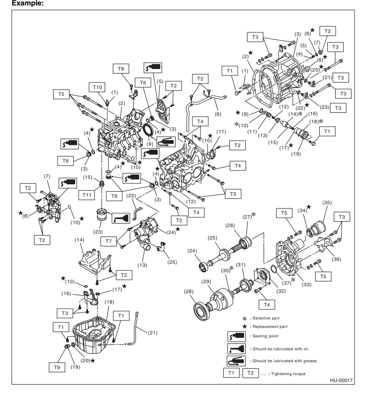

## Foreword 1. A:  Foreword

These manuals are used when performing mainte-nance, repair or diagnosis of Subaru LEGACY & LEGACY OUTBACK.

Applicable model:
2010 2011 2012 2013 The manuals contain the latest information at the time of publication. Changes in the specifications, methods, etc. may be made without notice.

Page

1.     How to Use This Manuals  

## 1.  How To Use This Manuals A:  How To Use This Manuals 1. Structure

Each section consists of SCT that are broken down into SC that are divided into sections for each component. The specification, maintenance and other information for the components are included, and the diagnostic information has also been added where necessary.

## 2.  Contents

The first page has an index with tabs.

## 3.  Component

Illustrations are provided for each component. The information necessary for repair work (tightening torque, grease up points, etc.) is described on these illustrations. Information is described using symbol.

To order parts, refer to parts catalogue.

## 4.  Definition Of "Note", "Caution" And "Warning"

- NOTE:
Describes supplementary explanations for efficient operation.

- CAUTION:
Describes particular items to be followed and items to be prohibited to avoid vehicle or parts damage.

- WARNING:
Describes items to be strictly prohibited to avoid serious injury to the person doing the work or people in the area, and items to be strictly followed to avoid any deficiency or accident.

## 5.  Specification

If necessary, specifications are also included.

## 6. Inspection

Inspections to be carried out before and after maintenance are included.